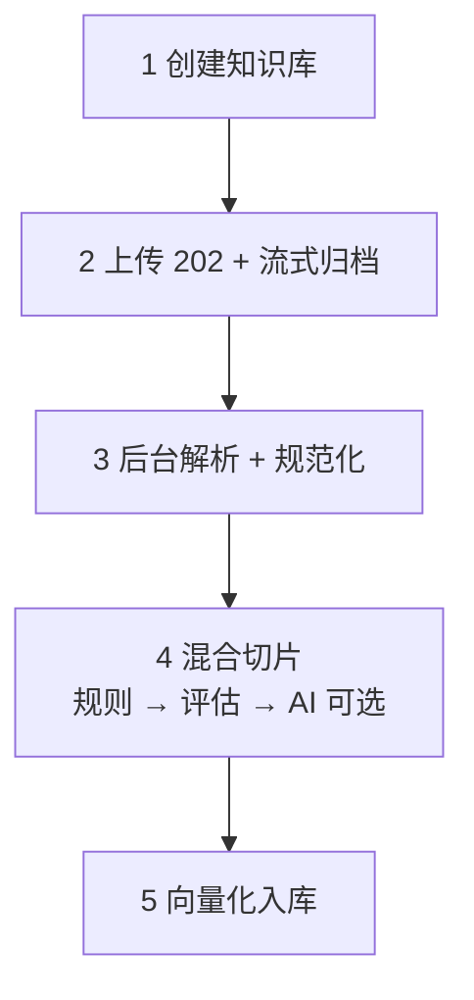
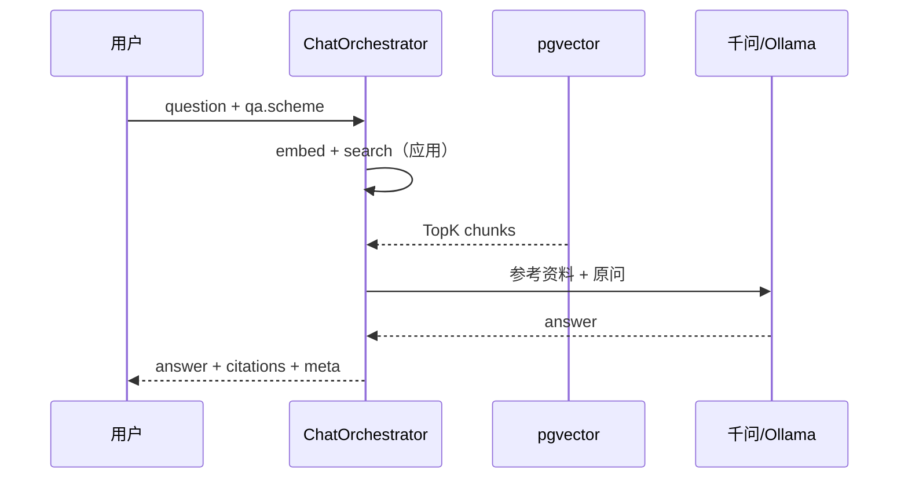
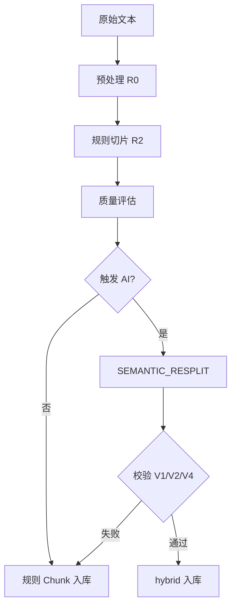
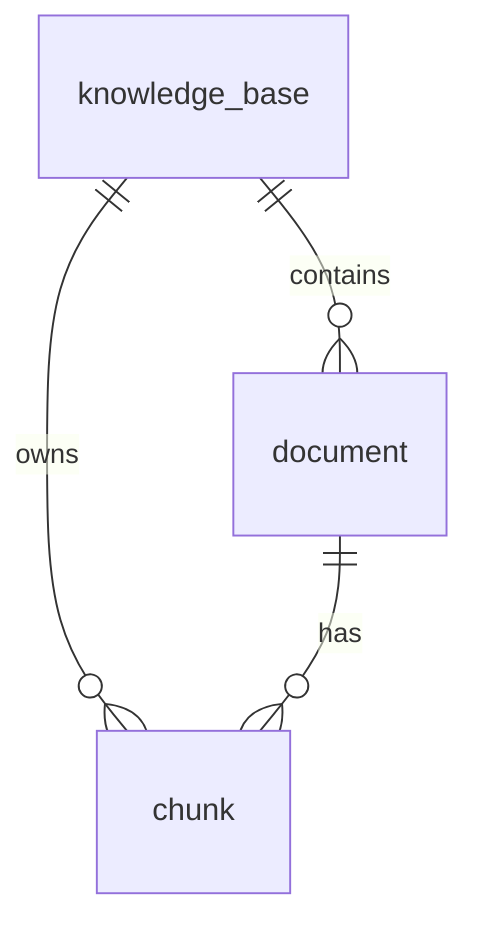

# RagChunk

基于 **Spring Boot 4** 的 RAG 知识库服务：创建库 → 上传文档 → **混合切片**（规则 + 千问/Ollama 按需）→ 向量入库 → 检索问答。

> **⚠️ 状态说明**：核心功能 **已实现** 且 **接口曾联调通过**；解析/切片/AI/问答的 **业务正确性尚未验收**，仅供开发联调。详见 [docs/开发进度.md](docs/开发进度.md)。

| 项 | 说明 |
|----|------|
| 技术栈 | Java 17、Spring Boot 4.0.6、MyBatis Plus、PostgreSQL + pgvector、Flyway |
| 已实现能力 | 离线建库、混合切片 T0/T1/T2/T4/T8、pgvector 检索、**智能问答四种编排** |
| **交付状态** | **开发完成 · 测试不充分 · 正确性未保证** |
| 支持格式 | `txt` / `md` / `docx` / `xlsx` / `xls`（**PDF 未实现**） |
| **文档索引** | [docs/README.md](docs/README.md) |
| **开发进度** | [docs/开发进度.md](docs/开发进度.md) |
| **创建库参数** | [docs/创建知识库接口参数.md](docs/创建知识库接口参数.md) |
| **智能问答** | [docs/智能问答方案.md](docs/智能问答方案.md) |
| **异步上传** | [docs/异步上传与OSS.md](docs/异步上传与OSS.md) |

---

## 目录

- [API 速览](#api-速览)
- [智能问答方案](#智能问答方案)
- [快速开始](#快速开始)
- [构建与运行](#构建与运行)
- [配置与 Profile](#配置与-profile)
- [RAG 与业务流程](#rag-与业务流程)
- [混合切片（规则 + AI）](#混合切片规则--ai)
- [分段与检索参数](#分段与检索参数)
- [数据库](#数据库)
- [测试](#测试)
- [本地 Ollama](#本地-ollama)
- [本机安装 pgvector](#本机安装-pgvector-windows)
- [模块结构](#模块结构)
- [功能状态](#功能状态)

---

## API 速览

```
POST 创建知识库 → POST 上传文档 → GET 切片 / POST 问答
```

| 步骤 | 方法 | 路径 | 说明 |
|------|------|------|------|
| 创建知识库 | `POST` | `/api/v1/knowledge-bases` | 名称 + 切片/检索/AI 等全量配置 |
| 查询知识库 | `GET` | `/api/v1/knowledge-bases` | 全部列表 |
| 查询单个 | `GET` | `/api/v1/knowledge-bases?id={kbId}` | 按 ID |
| 上传文档 | `POST` | `/api/v1/knowledge-bases/{kbId}/documents` | **202 异步**；单文件 `file`，批量 `files` |
| 重复训练 | `POST` | `.../documents/{docId}/retrain` | 202，基于已归档原件 |
| 上传看板 | `GET` | `.../upload-dashboard` | 状态/阶段汇总 |
| 批量任务 | `GET` | `.../upload-batches/{batchId}` | 批次进度 |
| 文档列表 | `GET` | `/api/v1/knowledge-bases/{kbId}/documents` | 含 `processStage`、OSS 字段 |
| 切片列表 | `GET` | `/api/v1/knowledge-bases/{kbId}/chunks` | `docId` 可选；空则返回该库全部切片 |
| 单文档切片 | `GET` | `/api/v1/knowledge-bases/{kbId}/documents/{docId}/chunks` | |
| 问答 | `POST` | `/api/v1/knowledge-bases/{kbId}/chat` | `question`；可选 `qaScheme`；响应含 `meta.schemeName` |

**Swagger UI**（启动后）：

| 入口 | URL |
|------|-----|
| **Scalar API 文档（推荐）** | http://localhost:8080/scalar |
| 兼容入口 | http://localhost:8080/doc.html（重定向到 Scalar） |
| Swagger UI | http://localhost:8080/swagger-ui/index.html |
| OpenAPI JSON | http://localhost:8080/v3/api-docs |

> Knife4j 4.5 与 SpringDoc 3 / Boot 4 不兼容，已改用 SpringDoc 官方 UI。说明见 [docs/开发进度.md](docs/开发进度.md) §11.3。

上传链路日志前缀：**`[文档上传]`**；问答链路：**`[智能问答]`**。

---

## 智能问答方案

创建库时可配置 `qa.scheme`，单次请求也可用 `qaScheme` 覆盖：

| 方案名称 | `schemeName` | 编码 | 说明 |
|----------|--------------|------|------|
| 纯应用流水线 | `pipeline` | `1` | 原问检索 → 生成（默认） |
| 协作渐进检索 | `collaborative_progressive` | `2` | 原问先搜；不足则 LLM 改写再搜 |
| 协作全量改写 | `collaborative_always` | `3` | 每条先改写再检索 |
| Agent 工具检索 | `agent` | `5` | LLM 调 `search_kb` tool |

```powershell
# 协作渐进检索（qaScheme=2，覆盖库配置）
$body = '{"question":"离线建库流程有几步？","qaScheme":2}'
Invoke-RestMethod -Method Post -Uri "http://localhost:8080/api/v1/knowledge-bases/$kbId/chat" `
  -ContentType "application/json; charset=utf-8" `
  -Body ([System.Text.Encoding]::UTF8.GetBytes($body))
```

详见 **[docs/智能问答方案.md](docs/智能问答方案.md)**。

---

## 快速开始

### 1. 环境

- JDK 17+
- PostgreSQL 16+ 与 **pgvector**（本机 17 见 [本机安装 pgvector](#本机安装-pgvector-windows)）
- 可选：`DASHSCOPE_API_KEY`（通义千问）或 Ollama（见 [本地 Ollama](#本地-ollama)）

### 2. 启动

```powershell
cd d:\code\RagChunk
.\mvnw.cmd clean compile
.\mvnw.cmd spring-boot:run
# 或：.\scripts\dev-run.cmd（默认 local+ollama；仅 PG：dev-run.cmd nollama）
```

### 3. 调用示例

**创建知识库**

```powershell
$body = @{
  name = "demo"
  chunking = @{ aiMode = "auto" }
  rule = @{ maxChars = 1200 }
  retrieval = @{ topK = 3; scoreThreshold = 0.5 }
} | ConvertTo-Json -Depth 5

$kb = Invoke-RestMethod -Method Post -Uri "http://localhost:8080/api/v1/knowledge-bases" `
  -ContentType "application/json" -Body $body
$kbId = $kb.id
```

**上传文档（202 异步 + 流式归档）**

```powershell
$upload = Invoke-RestMethod -Method Post `
  -Uri "http://localhost:8080/api/v1/knowledge-bases/$kbId/documents?smartChunk=true" `
  -Form @{ file = Get-Item ".\scripts\sample.md" }
$docId = $upload.docId

# 轮询至建库完成后再问答
do {
  Start-Sleep -Seconds 2
  $doc = Invoke-RestMethod "http://localhost:8080/api/v1/knowledge-bases/$kbId/documents/$docId"
} while ($doc.status -notin @("SUCCESS", "FAILED"))
if ($doc.status -eq "FAILED") { throw $doc.errorMessage }
```

上传流程说明见 **[docs/异步上传与OSS.md](docs/异步上传与OSS.md)**。

**问答**

```powershell
$chatBody = '{"question":"你的问题"}'
Invoke-RestMethod -Method Post `
  -Uri "http://localhost:8080/api/v1/knowledge-bases/$kbId/chat" `
  -ContentType "application/json; charset=utf-8" `
  -Body ([System.Text.Encoding]::UTF8.GetBytes($chatBody))
```

**一键端到端**

```powershell
.\scripts\test-e2e.ps1
```

### 4. 运行模式

| 模式 | 条件 | 行为 |
|------|------|------|
| 离线开发 | 无 `DASHSCOPE_API_KEY`，未开 Ollama | 本地 hash 向量；切片以规则为主；问答返回检索片段摘要 |
| 通义千问 | 设置 `DASHSCOPE_API_KEY` | DashScope Embedding + 千问切片/问答 |
| 本地 Ollama | `local,ollama` profile | OpenAI 兼容接口做切片与问答；向量默认本地 hash |

---

## 构建与运行

项目使用 **Maven Wrapper**（`mvnw.cmd`），无需系统安装 Maven：

```powershell
.\mvnw.cmd clean compile
.\mvnw.cmd test
.\mvnw.cmd spring-boot:run
```

| 脚本 | 说明 |
|------|------|
| `scripts\dev-run.cmd` | 本地开发启动（默认 `local,ollama`；`nollama` 仅本机库） |
| `scripts\stop-app.cmd` | 释放 8080 端口 |
| `scripts\mvn.ps1` | 包装 `mvnw` 的 PowerShell 入口 |
| `scripts\test-e2e.ps1` | 创建库 → 上传 → 问答 |

---

## 配置与 Profile

| Profile | 说明 |
|---------|------|
| `local`（默认） | 本机 PostgreSQL `localhost:5432/ragchunk`，`postgres` / `123` |
| `ollama` | 本地大模型 `application-ollama.yaml` |
| `docker` | Docker PostgreSQL，`localhost:5433` |
| `array` | 本机 PG，`real[]` 向量，无 pgvector |
| `inmemory` | 内存存储，单元测试/演示 |

```yaml
# 核心配置（application.yaml / 创建库请求体）
ragchunk:
  chunking:
    mode: hybrid
    ai-mode: auto              # never | auto | always
  rule:
    max-chars: 1200
    min-chars: 80
    overlap: 80
  quality:
    score-threshold: 70
  ai:
    chunk-model: qwen-plus
    max-calls-per-doc: 1
    max-input-tokens: 8000
  embedding:
    model: text-embedding-v3
    dimensions: 1024
  retrieval:
    top-k: 3
    score-threshold: 0.5
  qa:
    scheme: 1
    rewrite-min-score: 0.35
    max-llm-calls: 2
    max-search-rounds: 2
    agent-max-iterations: 3
```

**环境变量（数据库）**

| 变量 | 默认 | 说明 |
|------|------|------|
| `RAGCHUNK_DB_HOST` | `localhost` | |
| `RAGCHUNK_DB_PORT` | `5432` | Docker 常用 `5433` |
| `RAGCHUNK_DB_NAME` | `ragchunk` | |
| `RAGCHUNK_DB_USER` | `postgres` / `ragchunk` | 随 profile |
| `RAGCHUNK_DB_PASSWORD` | `123` / `ragchunk` | |

---

## RAG 与业务流程

### 标准 RAG 三阶段

| 阶段 | 含义 | 在线步骤 |
|------|------|----------|
| **检索** Retrieve | 从向量库找相关 Chunk | Query 向量化 → TopK / 阈值 → 可选 Rerank |
| **增强** Augment | 把命中片段写入 Prompt | 组装上下文 |
| **生成** Generate | LLM 有据作答 | 千问 / Ollama |

### 离线建库（5 步）



| 步骤 | 已实现 · 已测试 | 未实现 · 未测试 |
|------|------------------|------------------|
| 创建库 | 名称 + 配置快照 | 分步向导、更新库 API |
| 上传 | 202 异步、流式归档、轮询、看板 | PDF、OSS 服务端拉取、Webhook |
| 解析 | R0 规范化（txt/md/docx/xlsx/xls） | 内容质量系统验收 |
| 切片 | 规则 + T2/T4/T8 + `SEMANTIC_RESPLIT` | 父子模式、T3/T5/T6/T7 |
| 入库 | Embedding + pgvector | 经济索引、关键词倒排 |

文档处理：`POST` 返回 **202** → 轮询 `processStage`（`QUEUED` → … → `SUCCESS` / `FAILED`）。详见 [异步上传与OSS.md](docs/异步上传与OSS.md)。

### 在线问答

默认 **纯应用流水线**：应用负责向量检索，LLM 仅生成答案。其它编排见 [智能问答方案](#智能问答方案) 与 [docs/智能问答方案.md](docs/智能问答方案.md)。



### 关键约束

| 规则 | 说明 |
|------|------|
| Embedding 一致 | 同一知识库入库与查询须用同一向量模型 |
| 分段模式 | 当前仅 **通用** 单层 Chunk（父子模式未实现） |
| 有据作答 | 无命中时应说明「未找到」，避免编造 |

功能状态总览见 [docs/开发进度.md](docs/开发进度.md) §3。

---

## 混合切片（规则 + AI）

**原则**：先规则切片 → 质量评估 → 按需 AI → 校验失败则回退规则结果。



### 混合切片触发规则

| 触发 ID | 条件 | 任务 |
|---------|------|------|
| **T1** | `ai_mode=never` | 不调 AI |
| **T0** | `ai_mode=always` | 语义重切 |
| **T2** | `auto` 且 `quality_score < 70` | 语义重切 |
| **T4** | `auto` 且字数>1500 且仅 1 段 | 语义重切 |
| **T8** | 上传 `smartChunk=true` | 语义重切（优先） |

**决策顺序**（`auto`）：`never` → 规则；`always` → AI；`smartChunk=true` → AI；质量分低或单段过长 → AI；否则规则。

**质量分**（简化）：

```text
quality_score = 100 - short_ratio*40 - weak_boundary_ratio*50 - (single_chunk_doc ? 30 : 0)
```

**AI 输出**：JSON `{"chunks":[{"text":"..."}]}`；校验 V1 段长、V2 覆盖率≥95%、V4 JSON 合法；失败重试 1 次后 `ai_fallback=true`。

触发规则见上文；详见 [docs/开发进度.md](docs/开发进度.md) §5。

---

## 分段与检索参数

### 分段模式

| 模式 | 状态 |
|------|------|
| 通用（单层 Chunk） | 已实现 · 已测试 |
| 父子（子段检索、父段返回） | 未实现 · 未测试 |

通用参数：`max_chars`（默认 1200）、`min_chars`（80）、`overlap`（80）。

### 索引

| 方式 | 状态 |
|------|------|
| 高质量向量（pgvector） | 已实现 · 已测试 |
| 经济关键词倒排 | 未实现 · 未测试 |
| 混合检索 / Rerank | 未实现 · 未测试 |

### 检索（问答时）

| 参数 | 默认 | 说明 |
|------|------|------|
| `topK` | 3 | 最多送入 LLM 的 Chunk 数 |
| `scoreThreshold` | 0.5 | 低于阈值的片段丢弃 |

调参速查：答非所问 → 提高阈值、减小 TopK；总说找不到 → 降低阈值或补文档。字段说明见 [docs/创建知识库接口参数.md](docs/创建知识库接口参数.md)。

---

## 数据库

| 项 | 值 |
|----|-----|
| 引擎 | PostgreSQL 16+ |
| 扩展 | pgvector |
| Schema | Flyway `src/main/resources/db/migration` |
| ORM | MyBatis Plus（`knowledge_base`、`document`）+ JdbcTemplate（`chunk` 向量） |
| 向量维度 | 1024（与 `text-embedding-v3` 一致） |

### 表关系



| 表 | 说明 |
|----|------|
| `knowledge_base` | 库元数据 + `config_json` 配置快照 |
| `document` | 上传记录、状态、`quality_score`、`ai_triggered` 等 |
| `chunk` | 切片正文 + `vector(1024)`，HNSW 余弦检索 |

删除知识库 / 文档会 **CASCADE** 删除下属切片。上传失败时应用层删除该 `doc_id` 的 chunk 并标记 `FAILED`。

### 故障：`missing table [document]`

| 原因 | 处理 |
|------|------|
| 连错库 | 确认库名为 `ragchunk` |
| Flyway 未跑 | `.\mvnw.cmd clean compile` 后重启；看日志 Flyway |
| 无 pgvector | 安装扩展后重启 |
| 环境变量指向 Docker | 本机开发清除 `RAGCHUNK_DB_PORT=5433` 等 |

```sql
SELECT tablename FROM pg_tables WHERE schemaname = 'public';
SELECT * FROM flyway_schema_history;
```

表结构与数据保存见 [docs/开发进度.md](docs/开发进度.md) §9。

### Docker PostgreSQL（可选）

```powershell
.\scripts\start-postgres-docker.ps1
# 或 docker compose up -d
.\mvnw.cmd spring-boot:run "-Dspring-boot.run.profiles=docker"
```

---

## 测试

```powershell
.\mvnw.cmd test                    # 默认 inmemory，不依赖 PG
.\mvnw.cmd spring-boot:run         # 联调
.\scripts\test-e2e.ps1             # 端到端
```

| 测试类 | 内容 |
|--------|------|
| `KnowledgeBaseServiceTest` | 创建库、配置合并 |
| `RuleChunkerTest` | 规则切片 |
| `AiChunkTriggerTest` | T2/T8 |
| `HybridChunkingServiceTest` | `aiMode=never` |

PostgreSQL 集成测试（需 Docker）：

```powershell
$env:RUN_PG_INTEGRATION = "1"
.\mvnw.cmd test -Dtest=RagChunkPostgresIntegrationTest
```

联调清单与 Scalar 调试见 [docs/开发进度.md](docs/开发进度.md) §11。

---

## 本地 Ollama

通过 OpenAI 兼容接口 `http://<host>:11434/v1` 调用对话与切片。

```powershell
.\mvnw.cmd spring-boot:run "-Dspring-boot.run.profiles=local,ollama"
# 或
$env:SPRING_PROFILES_ACTIVE = "local,ollama"
$env:OLLAMA_BASE_URL = "http://192.168.14.57:11434/v1"
$env:OLLAMA_CHAT_MODEL = "qwen2.5:14b"
```

| 项 | 默认（`application-ollama.yaml`） |
|----|-------------------------------------|
| 对话/切片模型 | `qwen2.5:14b` |
| 远程向量 | 关闭（`embedding.remote-enabled=false`，用本地 hash） |

上传 `smartChunk=true` 且库 `aiMode` 非 `never` 时会调 Ollama 做语义重切。`chat` 404 时检查 `base-url` 须带 `/v1`；连接超时检查防火墙与 `192.168.14.57:11434` 可达性。

---

## 本机安装 pgvector（Windows）

**管理员** cmd，项目根目录：

```cmd
cd /d d:\code\RagChunk
scripts\install-pgvector-windows.cmd -PgRoot "D:\AnZhuang\PostgreSQL17" -SuperPassword "123"
```

脚本会复制 `vector.dll`、扩展 SQL、重启 `postgresql-x64-17`、创建库 `ragchunk` 并 `CREATE EXTENSION vector`。

连接：`localhost:5432/ragchunk`，`postgres` / `123`（与 `application-local.yaml` 一致）。

安装后验证：`psql -U postgres -d ragchunk -c "CREATE EXTENSION IF NOT EXISTS vector;"`

---

## 模块结构

```
src/main/java/com/xtsh/ragchunk/
├── knowledge/       # 知识库 CRUD、KnowledgeBaseConfig、QaConfig
├── document/        # 上传、DocumentService、Controller
├── ingest/          # 解析、规则切片、AI 触发、语义重切、ChunkIngestPipeline
├── chunk/           # 切片查询 API
├── embedding/       # DashScope / Ollama / 本地 hash
├── document/        # 流式上传、异步入库、看板
├── storage/         # 原件 putStream / openStream
├── vector/          # PgVectorStore、内存 VectorStore
├── chat/            # ChatOrchestrator、检索/改写/生成、Agent tool
├── integration/     # DashScope / OpenAI 兼容 HTTP（含 tools）
└── config/          # MyBatis、Swagger、存储模式
```

---

## 功能状态

完整清单见 **[docs/开发进度.md](docs/开发进度.md) §3**。摘要：

| 分类 | 示例 |
|------|------|
| **已实现 · 已测试** | 建库、202 上传、流式归档、异步入库、四种问答编排、`mvn test` / 联调脚本 |
| **未实现 · 未测试** | PDF、删除/更新库 API、S3 SDK、OSS 拉取、Webhook/SSE、Rerank、父子分段 |

---

## 许可证

见项目仓库约定（如有）。
