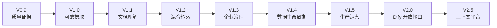

# RagChunk 生产级总体演化方案

> 本文是 V0.9～V2.5 的唯一规范性产品与技术路线。README、项目进度和版本文档只摘要当前状态并链接本文，不维护另一份完整路线。

## 1. 产品定位

RagChunk 是面向企业私有知识场景的专业 RAG 核心服务，不建设通用低代码应用平台。产品能力以 RAGFlow 的文档理解、检索可解释性、评测和运营能力为参考基准；技术上保持 Java/Spring 企业控制面的优势；Dify 是开放接口和生态兼容的集成对象，而不是 RagChunk 的运行依赖。

最终路线是：**产品方向对标 RAGFlow，开放接口和生态兼容对接 Dify，保留 RagChunk 可控混合切片与失败回退差异化。**

## 2. 不变的技术边界

- Java/Spring 主系统是业务唯一事实源，负责权限、任务状态、配置、版本、事务、持久化、审计和降级决策。
- Python 仅作为后续可选、可替换的能力服务，用于 OCR、版面、多模态、Rerank 或实验算法；未配置时纯 Java 主链必须可运行。
- Python 只返回候选结构化结果，Java 校验后才可入库；跨进程协议必须版本化、限时、可追踪并可降级。
- V0.9 不引入 Python 运行时、Sidecar 或占位接口；首个 Python 能力在 V1.1 另行完成协议、许可证、数据出域与回滚审核。
- Dify 不成为知识、权限或任务事实源。V2.0 先提供外部知识库 API，再按真实需求增加 Tool/MCP 适配。

## 3. 能力基准映射

| 能力域 | RagChunk 保留优势 | RAGFlow 参考点 | 目标版本 | 非复制项 |
|---|---|---|---|---|
| 企业控制面 | Java/Spring 事务、类型契约、可运维模块化单体 | 完整知识库运营闭环 | V1.3～V1.5 | 不为技术对齐重写 Python 主系统 |
| 文档摄取 | 流式归档、异步处理、失败回退 | 任务可恢复、解析过程可观察 | V1.0 | 不在 V0.9 提前拆分分布式 Worker |
| 文档理解 | 规则＋AI 可控混合切片 | OCR、版面、表格、多模态解析 | V1.1 | 不复制所有解析器；按企业语料收益接入 |
| 检索质量 | pgvector、四种问答编排、显式配置 | 混合召回、Rerank、逐阶段调试 | V1.2 | 不在同一旧索引上比较不同 Embedding 空间 |
| 质量评测 | 确定性指标优先、运行证据可追溯 | 数据集、运行比较、可解释评测 | V0.9 | 不把概率 Judge 当唯一质量结论 |
| 权限治理 | Spring Security/企业目录集成基础 | 多租户、ACL、审计 | V1.3 | 不在无租户模型时伪造企业隔离 |
| 数据生命周期 | Java 侧一致性与删除传播 | 连接器、增量同步、保留策略 | V1.4 | 不在同版本同时铺开全部 SaaS 连接器 |
| 生产运营 | JVM 可观测、限流、配额、备份恢复 | 任务/模型/质量运营视图 | V1.5 | 不在证据不足时强制微服务化 |
| 生态开放 | 稳定、版本化、可审计的知识服务 API | 外部知识库与工具化能力 | V2.0 | 不复制 Dify 工作流、模型市场和应用编排 |
| 上下文平台 | 可治理知识事实源与可替换算法面 | 面向 Agent 的高质量上下文供给 | V2.5 | 不演化成通用 Agent 开发平台 |

## 4. 单一路线与门禁

| 版本 | 业务结果 | 关键能力 | 状态 |
|---|---|---|---|
| V0.9 | 建立问答与评测质量证据 | ChatRun、评测集、指标、运行比较、OpenAPI | 实施收尾，等待验收 |
| V1.0 | 摄取和索引可恢复 | 持久任务、幂等重试、DocumentVersion、IndexVersion 原子切换 | 未开始 |
| V1.1 | 提升复杂文档理解 | OCR、版面、表格、多模态；首次评审可选 Python 能力服务 | 未开始 |
| V1.2 | 提升检索质量 | 全文＋向量、过滤、RRF、Rerank、父子上下文、检索调试 | 未开始 |
| V1.3 | 建立企业治理边界 | 租户、用户、角色、知识库成员、文档 ACL、审计 | 未开始 |
| V1.4 | 管理数据全生命周期 | 连接器、增量同步、删除传播、保留与清理策略 | 未开始 |
| V1.5 | 达到生产运营要求 | 指标、告警、限流、配额、成本、备份恢复、灰度 | 未开始 |
| V2.0 | 接入 Dify 等上层生态 | 外部知识库 API 优先，按需增加 Tool/MCP | 未开始 |
| V2.5 | 形成企业上下文平台 | 多知识库路由、上下文编排、多跳与高级 Agent 支撑 | 未开始 |

每个未来版本必须在 `docs/versions/Vx.x/` 建立独立的需求单、详细设计和测试用例设计，并分别通过门禁 A/B。V0.9 的批准不授权任何未来版本实施；每版验收后停止，等待开发者下一条版本指令。

## 5. 分阶段完成门槛

- V0.9：成功和失败问答均可追踪；冻结配置和数据集可复现；确定性指标、可选 Judge、运行比较及兼容契约有证据。
- V1.0：服务重启后任务可恢复；重复执行不产生重复 Chunk；新索引失败不影响活动索引。
- V1.1：复杂文档基准集证明新增解析能力有效；Python 禁用或超时时 Java 主链可降级。
- V1.2：标准集 Recall@K、MRR 和引用准确率相对 V0.9 基线达到审核阈值。
- V1.3：跨租户、越权文档与撤权缓存负向测试通过。
- V1.4：源端删除或撤权可在约定时间内传播到有效索引。
- V1.5：依赖故障不拖垮主服务，备份可恢复，发布不中断在线查询。
- V2.0：Dify 通过版本化接口使用 RagChunk，且不持有 RagChunk 内部事实状态。
- V2.5：只有容量和业务复杂度证据成立时才引入分布式 Worker、多跳检索或服务拆分。

## 6. V0.9 当前交付边界

V0.9 只交付 Java 主系统内的问答追踪、评测数据集、异步评测、确定性指标、可选 Judge、运行比较和管理 API。它不交付前端、认证、数据删除、Python 服务或 Dify 接口。当前实现与剩余风险以 [V0.9 实施与验收报告](../versions/V0.9/04-实施与验收报告.md) 为准。

## 7. 变更记录

| 日期 | 变更 | 原因 |
|---|---|---|
| 2026-08-27 | 建立初始生产级版本路线 | 从工程治理进入业务演化 |
| 2026-09-05 | 重整为 V0.9～V2.5 唯一路线，加入 RAGFlow 能力基准、Java/Python 边界与 Dify 集成顺序 | 落实 `REQ-V09-001`～`REQ-V09-003`、`REQ-V09-012/013` |
