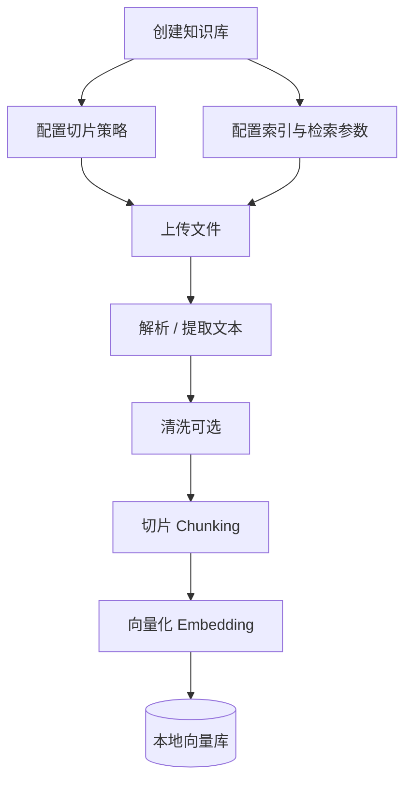
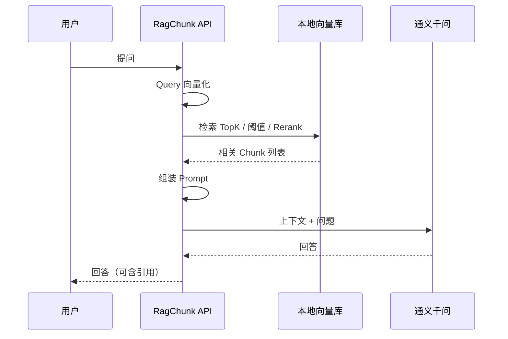

> **已归档**。主文档见 [README.md](../../README.md)。

# 架构与业务流程

## 1. 业务定位

RagChunk 实现 **检索增强生成（RAG）**：将自有文档变为可检索知识，在用户提问时召回相关片段，再交给大模型生成答案。

| 阶段 | 作用 |
|------|------|
| **检索** | 从知识库找出与问题最相关的分段 |
| **增强** | 将检索结果与用户问题一并作为上下文 |
| **生成** | LLM（千问）基于上下文生成回答 |

> 标准 RAG 步骤表见 [rag-flow.md](rag-flow.md)；业务活动见 [business-process.md](business-process.md)。

## 2. 端到端流程

### 2.1 离线：建库（Ingest）



| 步骤 | 说明 |
|------|------|
| 创建知识库 | 绑定切片模式、Embedding 模型、默认 TopK/阈值等 |
| 上传文件 | PDF、DOCX、TXT、Markdown 等 |
| 解析 / 清洗 | 抽纯文本；去多余空白、URL 等（见 [chunking.md](chunking.md)） |
| 切片 | **规则为主**；千问可用于摘要、Q&A、难文档语义切分（可选） |
| 向量化 | 每个 Chunk 用 **同一套** Embedding 模型生成向量并持久化 |

> **注意**：入库与查询必须使用 **相同的 Embedding 模型**。

### 2.2 在线：问答（Query）



## 3. 与 Dify 快速创建对照

| 阶段 | Dify | RagChunk |
|------|------|----------|
| 数据源 | 本地文件 / Notion / 网页 / 空库 | 以本地文件为主（可扩展） |
| 分段 | 通用 / 父子 + 规则参数 | 同左；千问增强为自研扩展 |
| 索引 | 高质量（向量）/ 经济（关键词） | 规划支持高质量；经济可选 |
| 处理状态 | waiting → parsing → cleaning → splitting → indexing | 建议异步任务 + 状态轮询 |
| 问答 | 应用内上下文 / 知识检索节点 | REST API + 本地检索 |

参考：[Dify 知识库](https://docs.dify.ai/zh/use-dify/knowledge/readme)、[快速创建](https://docs.dify.ai/zh/use-dify/knowledge/create-knowledge/introduction)。

## 4. 约束与不变量

| 规则 | 说明 |
|------|------|
| 数据源类型 | 创建后不宜随意切换 |
| 分段模式 | **通用 / 父子** 创建后不可改；分隔符、最大长度等可调 |
| 高质量 → 经济 | 不建议降级；经济可升级为高质量 |
| Embedding 一致 | 同一知识库、入库与查询共用一套向量模型 |

## 5. 模块规划（待实现）

```
ragchunk/
├── knowledge/          # 知识库 CRUD、配置
├── document/           # 上传、解析、任务状态
├── chunk/              # 规则切片、父子段、千问增强
├── embedding/          # 向量化、DashScope Embedding
├── vector/             # 本地向量存储抽象
├── retrieval/          # 检索、TopK、阈值、Rerank
└── chat/               # Prompt 组装、千问对话
```

## 6. 配置项划分

| 类型 | 生效时机 | 示例 |
|------|----------|------|
| **入库配置** | 离线建库 | 切片模式、分隔符、Embedding 模型 |
| **检索配置** | 在线问答 | TopK、Score 阈值、Rerank、混合权重 |

详见 [retrieval.md](retrieval.md)。
