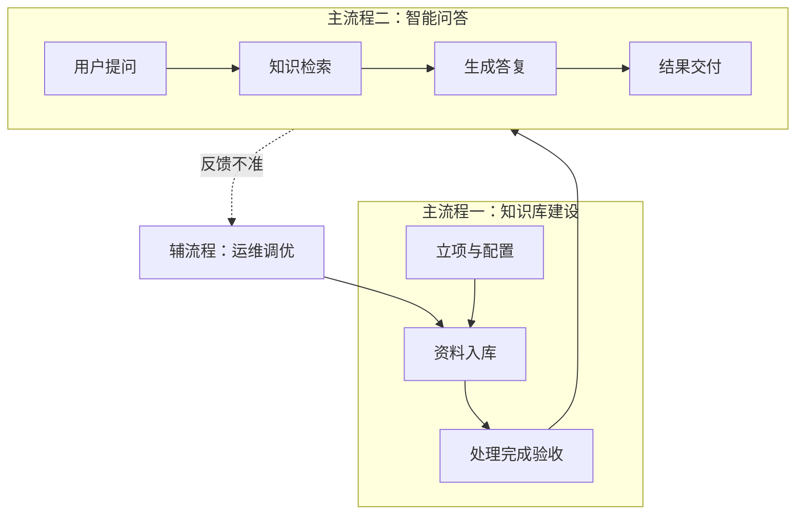
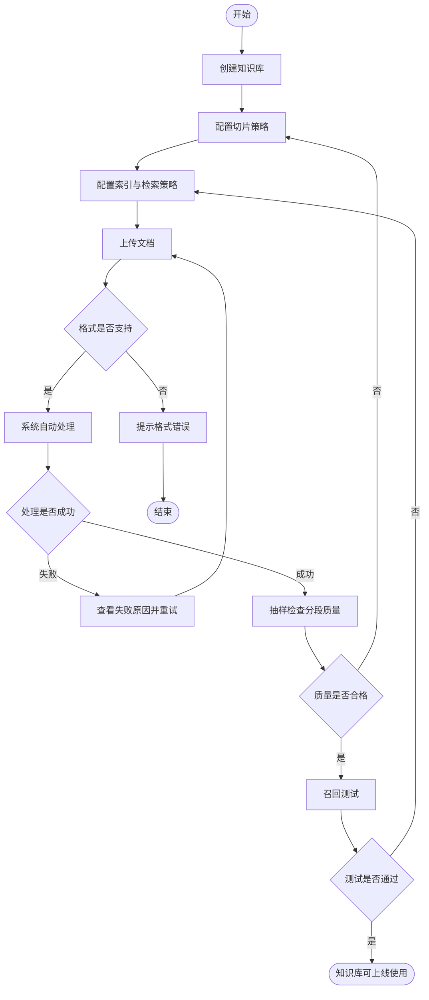
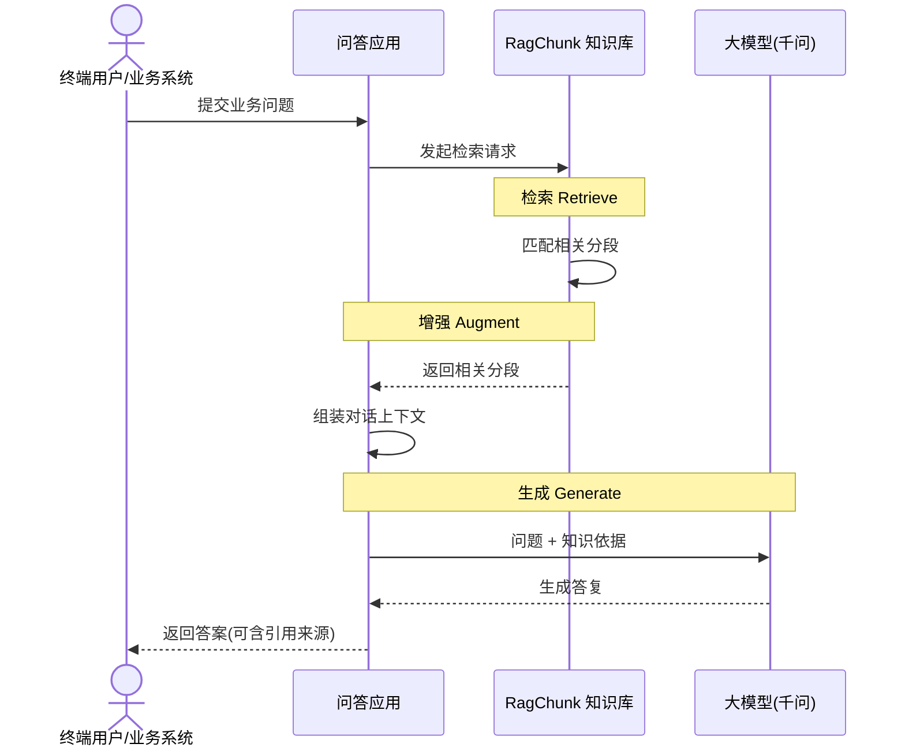

> **已归档**。请以 [开发进度.md](../开发进度.md) 与 [docs/README.md](../README.md) 为准。

# RagChunk 知识库业务流程文档

| 项目 | 说明 |
|------|------|
| 文档名称 | RagChunk 知识库业务流程说明 |
| 版本 | v1.0 |
| 适用范围 | RagChunk 知识库建设、检索问答及相关运维 |
| 读者 | 产品、业务、运营、研发、测试 |
| 依据 | 标准 RAG（检索增强生成）流程 |

---

## 1. 文档目的

本文从 **业务视角** 描述 RagChunk 知识库从「准备资料 → 建库入库 → 对外问答 → 持续运维」的完整业务流程，明确：

- 参与角色与职责  
- 业务场景与触发条件  
- 流程步骤、输入输出、业务规则  
- 异常处理与质量要求  

技术实现细节见 [标准 RAG 流程](rag-flow.md)、[架构说明](architecture.md) 及分段/索引/检索专题文档。

---

## 2. 业务背景与目标

### 2.1 背景

组织内部存在大量非结构化文档（制度、手册、FAQ、产品说明等），传统关键词搜索难以理解语义，纯大模型问答易产生幻觉且无法引用最新内部资料。

### 2.2 业务目标

| 目标 | 说明 |
|------|------|
| **知识沉淀** | 将文档转化为可管理、可检索的结构化知识 |
| **精准问答** | 用户用自然语言提问，系统基于真实文档片段回答 |
| **可追溯** | 回答可关联到具体文档/段落，便于核对与合规 |
| **可运营** | 支持文档增删改、检索效果调优、持续更新 |

### 2.3 业务价值（RAG 三阶段）

| 阶段 | 业务含义 |
|------|----------|
| **检索** | 从企业知识中找出与问题最相关的内容 |
| **增强** | 将找到的内容作为「依据」交给模型 |
| **生成** | 模型在依据之上组织语言，形成最终答复 |

---

## 3. 业务范围

### 3.1 范围内

- 知识库的创建与配置  
- 文档上传、处理、入库  
- 基于知识库的智能问答（含检索策略）  
- 知识库内容维护与检索效果验证  

### 3.2 范围外（本期或需单独规划）

- 模型训练与微调  
- 非文档类实时业务系统直连（需 API 集成项目）  
- 多租户计费与权限体系（可按企业规范扩展）  

---

## 4. 角色与职责

| 角色 | 职责 |
|------|------|
| **知识库管理员** | 创建知识库、配置切片与检索策略、上传/维护文档、组织召回测试 |
| **业务内容提供方** | 提供准确、及时的源文档，确认业务口径 |
| **终端用户** | 通过应用或接口提问，使用问答结果，反馈满意度 |
| **系统 / 应用集成方** | 将知识库接入客服、门户、工作流等场景 |
| **运维人员** | 保障服务可用、监控处理任务、处理失败与告警 |

---

## 5. 业务场景

| 场景编号 | 场景名称 | 触发方 | 业务诉求 |
|----------|----------|--------|----------|
| S1 | 新建知识库 | 管理员 | 为新业务线/新产品建立专属知识源 |
| S2 | 批量导入文档 | 管理员 | 将现有文件纳入知识库并自动处理 |
| S3 | 智能问答 | 终端用户 / 应用 | 根据知识库内容回答业务问题 |
| S4 | 检索效果调优 | 管理员 | 问答不准时调整策略并验证 |
| S5 | 知识更新 | 管理员 | 文档过期、修订后同步知识库 |
| S6 | 知识下线 | 管理员 | 停用错误或敏感文档，避免被检索 |

---

## 6. 业务流程总览

标准 RAG 在业务上拆为 **两条主流程**：

| 主流程 | 业务名称 | 执行频率 | 对应 RAG 阶段 |
|--------|----------|----------|----------------|
| **主流程一** | 知识库建设（离线） | 低，随资料更新 | 建库、索引 |
| **主流程二** | 智能问答（在线） | 高，随用户访问 | 检索 → 增强 → 生成 |
| **辅流程** | 知识运维与调优 | 中，按需 | 贯穿建设与应用 |

---

## 7. 主流程一：知识库建设

### 7.1 流程说明

将企业文档转化为 **可被语义检索的知识库**。管理员完成配置与上传后，系统自动完成解析、切片、向量化；处理成功后知识库方可对外提供问答。

### 7.2 业务流程图

### 7.3 流程活动明细表

| 活动编号 | 活动名称 | 执行角色 | 输入 | 输出 | 业务规则 |
|----------|----------|----------|------|------|----------|
| KB-01 | 创建知识库 | 管理员 | 业务需求、库名称与说明 | 知识库记录 | 一库对应一类业务知识域，命名应清晰可识别 |
| KB-02 | 配置切片策略 | 管理员 | 文档类型（FAQ/长文/手册） | 切片模式与参数 | 创建后 **分段模式不可改**；FAQ 宜用通用模式，长文可考虑父子模式 |
| KB-03 | 配置索引与检索策略 | 管理员 | 精度与成本要求 | 索引方式、默认 TopK、阈值等 | 默认推荐 **高质量向量索引**；检索参数主要影响 **问答阶段** |
| KB-04 | 上传文档 | 管理员 / 内容方 | 原始文件 | 文档清单 | 单文件大小、格式需符合平台限制；内容应经业务审核 |
| KB-05 | 文档解析与清洗 | 系统 | 原始文件 | 规范化正文 | 自动执行；失败需记录原因供人工处理 |
| KB-06 | 文档切片 | 系统 | 正文 + 切片规则 | 知识分段（Chunk） | 默认规则切片；复杂文档可选用智能增强（可选） |
| KB-07 | 向量化与入库 | 系统 | 分段 | 可检索索引 | 入库与问答须使用 **同一套向量模型** |
| KB-08 | 分段质量检查 | 管理员 | 分段预览 | 检查结论 | 避免过短、过长、语义被截断；不合格则调整 KB-02 后重新处理 |
| KB-09 | 召回测试 | 管理员 | 典型业务问题列表 | 测试报告 | 模拟真实用户问法；未通过则调整 KB-03 或内容 |

### 7.4 业务产出物

| 产出物 | 说明 |
|--------|------|
| 已发布知识库 | 状态为「可检索」，允许应用绑定 |
| 文档与分段清单 | 支持审计与后续维护 |
| 建库配置单 | 切片模式、索引方式、默认检索参数（建议归档） |

---

## 8. 主流程二：智能问答

### 8.1 流程说明

终端用户或业务系统发起提问后，系统从知识库 **检索** 相关内容，将结果 **增强** 进对话上下文，再 **生成** 面向用户的答复。答复应基于检索到的依据，避免脱离文档臆测。

### 8.2 业务流程图

### 8.3 流程活动明细表

| 活动编号 | 活动名称 | 执行角色 | 输入 | 输出 | 业务规则 |
|----------|----------|----------|------|------|----------|
| QA-01 | 接收用户问题 | 用户 / 应用 | 自然语言问题 | 查询请求 | 问题应清晰；敏感问题走企业合规策略 |
| QA-02 | 知识检索 | 系统 | 问题 + 知识库 | 候选知识分段 | 按配置的向量/混合策略检索 |
| QA-03 | 结果筛选 | 系统 | 候选分段 | 命中分段（≤TopK） | 低于 **相似度阈值** 的片段不采用，减少胡编 |
| QA-04 | 精排（可选） | 系统 | 问题 + 候选 | 重排后分段 | 多库或要求高精度时启用 Rerank |
| QA-05 | 上下文增强 | 系统 | 命中分段 + 问题 | 完整 Prompt | 明确告知模型「仅依据给定资料回答」 |
| QA-06 | 生成答复 | 系统（千问） | Prompt | 自然语言答案 | 无命中分段时应回复「知识库中未找到」类话术 |
| QA-07 | 结果交付 | 应用 | 答案 | 用户可见结果 | 建议展示引用来源，便于核对 |
| QA-08 | 用户反馈（可选） | 用户 | 满意度 | 反馈记录 | 用于驱动辅流程调优 |

### 8.4 RAG 三阶段业务对照

| RAG 阶段 | 业务活动编号 | 业务关注点 |
|----------|--------------|------------|
| 检索 Retrieve | QA-02～QA-04 | 找得全、找得准；TopK 与阈值平衡召回与噪音 |
| 增强 Augment | QA-05 | 依据是否充分、Prompt 是否约束幻觉 |
| 生成 Generate | QA-06～QA-07 | 表述是否清晰、是否可溯源 |

---

## 9. 辅流程：知识运维与调优

### 9.1 流程说明

知识库上线后，随业务变化需持续维护文档与检索策略，保障问答质量。

### 9.2 流程活动明细表

| 活动编号 | 活动名称 | 执行角色 | 触发条件 | 业务动作 |
|----------|----------|----------|----------|----------|
| OP-01 | 新增文档 | 管理员 | 新业务资料 | 上传 → 自动处理 → 抽检 |
| OP-02 | 更新文档 | 管理员 | 制度/产品修订 | 替换或更新 → 重新索引 |
| OP-03 | 禁用/删除文档 | 管理员 | 内容失效或敏感 | 禁用检索或删除，避免误召回 |
| OP-04 | 召回测试 | 管理员 | 定期或投诉后 | 用典型问题验证，记录命中片段 |
| OP-05 | 调整检索策略 | 管理员 | 漏答、错答、噪音多 | 调整 TopK、阈值、是否 Rerank |
| OP-06 | 分段人工修正 | 管理员 | 分段质量差 | 编辑分段或调整切片规则后重处理 |

### 9.3 常见问题与业务处置

| 业务现象 | 可能原因 | 建议处置 |
|----------|----------|----------|
| 答非所问 | 阈值过低或分段噪音大 | 提高相似度阈值；检查分段质量 |
| 总说「没有相关信息」 | 阈值过高或文档未覆盖 | 降低阈值；补充文档；召回测试 |
| 专有名词搜不到 | 语义检索对术语不敏感 | 启用混合检索，提高关键词权重 |
| 回答过长、偏题 | TopK 过大 | 减小 TopK；启用 Rerank |
| 引用内容过时 | 文档未更新 | 执行 OP-02 更新文档 |

---

## 10. 业务规则汇总

| 编号 | 规则 | 说明 |
|------|------|------|
| BR-01 | 先建库、后问答 | 未完成索引的知识库不得对外提供问答 |
| BR-02 | 配置前置 | 切片模式、索引方式在入库前确定；分段模式创建后不可变更 |
| BR-03 | 模型一致 | 同一知识库建库与问答使用相同 Embedding 模型 |
| BR-04 | 有据作答 | 生成环节必须基于检索命中内容；无命中时禁止编造业务事实 |
| BR-05 | 可溯源 | 对外场景建议展示引用文档/段落 |
| BR-06 | 内容责权 | 文档准确性由内容提供方负责；管理员负责入库与策略 |
| BR-07 | 敏感管控 | 敏感文档须禁用或隔离知识库，符合企业安全规范 |

---

## 11. 业务状态说明

### 11.1 知识库状态

| 状态 | 含义 | 允许的操作 |
|------|------|------------|
| 配置中 | 已创建，未完成首次入库 | 上传、配置、处理 |
| 处理中 | 文档正在解析/切片/向量化 | 查询进度，不可问答 |
| 可用 | 索引完成且验收通过 | 问答、维护、调优 |
| 已停用 | 管理员停用 | 不可问答，可恢复 |

### 11.2 文档处理状态（业务视角）

| 状态 | 含义 | 管理员动作 |
|------|------|------------|
| 等待处理 | 已上传，排队中 | 等待 |
| 处理中 | 系统执行中 | 等待 |
| 已完成 | 可参与检索 | 抽检分段 |
| 失败 | 处理异常 | 查看原因，修正后重传 |
| 已禁用 | 不参与检索 | 可重新启用 |

---

## 12. 业务与系统步骤对照

便于业务与研发对齐，下表将 **业务活动** 映射到 **标准 RAG 技术步骤**（详见 [rag-flow.md](rag-flow.md)）：

| 业务活动 | 技术步骤（标准 RAG） |
|----------|----------------------|
| KB-01～KB-03 | 创建知识库、配置切片与索引 |
| KB-04 | 上传文件 |
| KB-05 | 解析、清洗 |
| KB-06 | 切片 |
| KB-07 | 向量化、写入索引 |
| KB-08～KB-09 | 质量检查、召回测试 |
| QA-01 | 接收用户问题 |
| QA-02～QA-04 | Query 向量化、检索、TopK/阈值、Rerank |
| QA-05 | 组装上下文（增强） |
| QA-06～QA-07 | LLM 生成、返回结果 |
| OP-01～OP-06 | 文档 CRUD、策略变更、重索引 |

---

## 13. 附录

### 13.1 术语表

| 术语 | 业务解释 |
|------|----------|
| 知识库 | 一组可被检索的企业文档及其索引的集合 |
| 文档 | 用户上传的一份原始资料（如一份 PDF） |
| 分段 / Chunk | 文档切分后的最小检索单元 |
| 向量 / Embedding | 文本的语义数字表示，用于相似度匹配 |
| TopK | 最多采用几条分段作为回答依据 |
| 相似度阈值 | 分段与问题相关程度的最低要求 |
| Rerank | 对初筛结果二次排序，提高相关性 |
| 召回测试 | 用样例问题验证检索是否命中预期内容 |

### 13.2 相关文档

| 文档 | 用途 |
|------|------|
| [rag-flow.md](rag-flow.md) | 标准 RAG 流程表与技术说明 |
| [architecture.md](architecture.md) | 架构与模块规划 |
| [chunking.md](chunking.md) | 分段策略（KB-02） |
| [hybrid-chunking.md](hybrid-chunking.md) | 混合切片规则与 AI 触发（KB-02 / KB-06） |
| [phase1-scope.md](phase1-scope.md) | **一期**离线建库与千问切片范围 |
| [indexing.md](indexing.md) | 索引模式（KB-03） |
| [retrieval.md](retrieval.md) | 检索参数（KB-03、QA-03～04） |

---

## 14. 修订记录

| 版本 | 日期 | 修订内容 | 作者 |
|------|------|----------|------|
| v1.0 | 2026-05-19 | 初版，基于标准 RAG 流程编写 | — |
