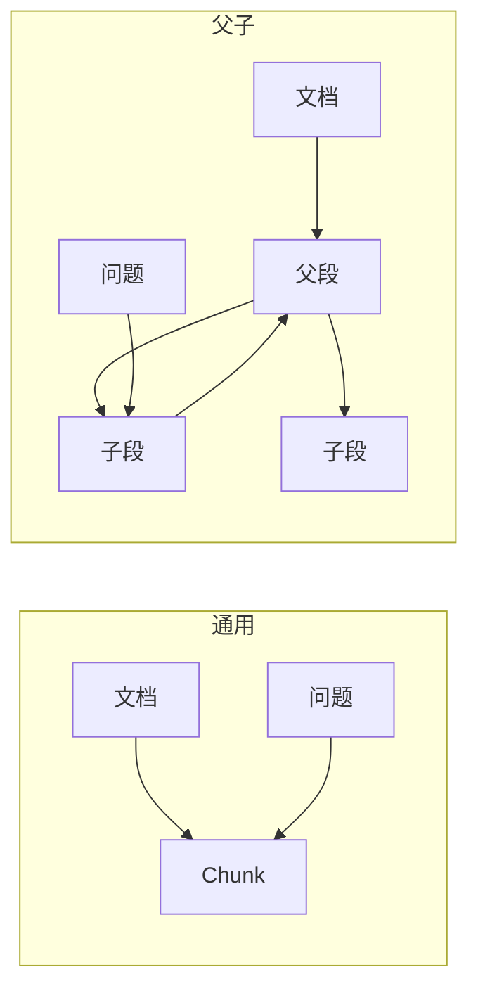

> **已归档**。主文档见 [README.md](../../README.md)。

# 分段策略（Chunking）

文档导入后会被拆成 **分段（Chunk）**，作为检索的最小单元。

参考：[Dify - 指定分段设置](https://docs.dify.ai/zh/use-dify/knowledge/create-knowledge/chunking-and-cleaning-text)  
业务活动：**KB-02**、**KB-06**（见 [business-process.md](business-process.md)）

## 1. 不变量

| 规则 | 说明 |
|------|------|
| 分段 **模式** 创建后不可改 | 通用 ↔ 父子 选定后锁定 |
| 分隔符、最大长度、重叠等 | 可调；变更后通常需 **重新索引** |

## 2. 分段模式对比

| 维度 | 通用模式 | 父子模式 |
|------|----------|----------|
| 结构 | 单层，统一规则 | 父段 + 子段两层 |
| 检索 | 命中哪段返回哪段 | **子段匹配**，**返回父段** |
| 索引要求 | 高质量 / 经济均可 | **仅高质量（向量）** |
| 适用 | FAQ、术语表、短条目 | 手册、论文、长文档 |

## 3. 通用模式参数

| 参数 | 含义 | 建议 |
|------|------|------|
| **分隔符** | 切分边界（如 `\n\n`） | 避免正文常见字符 |
| **分段最大长度** | 单段字符上限 | 中文常见 500～1500 字 |
| **分段重叠长度** | 相邻段重叠字符数 | 常见 50～100 |

## 4. 父子模式参数

### 4.1 父段

| 模式 | 行为 | 注意 |
|------|------|------|
| **段落** | 按规则切多个父段 | 适合结构清晰长文 |
| **全文** | 整篇一个父段 | 前 **10,000 token**；父段不可编辑需重传 |

### 4.2 子段

每个父段再按自己的分隔符与最大长度切子段。父子分隔符勿互为子集（如 `??` 与 `?`）。

### 4.3 实践：子段作检索钩子

父子模式下可将子段改为关键词、摘要或常见问法，父段保留完整上下文。

## 5. 分段前预处理

- 合并连续空格、换行、制表符  
- 三个以上换行 → 两个  
- 删除 URL、邮箱  

（全文父段模式下部分规则可忽略。）

## 6. RagChunk：混合切片（规则 + 千问）

| 方式 | 角色 | 说明 |
|------|------|------|
| **规则切片** | 主路径 | 稳定、可复现、低成本 |
| **千问增强** | 按需触发 | 质量不达标或特定文档类型时执行 |

**默认策略**：`ai_mode=auto` — 先规则切片并评估质量，命中触发条件再调千问。

- **一期实现范围**：[phase1-scope.md](phase1-scope.md)（T2/T4/T8 + `SEMANTIC_RESPLIT`）  
- **完整方案**：[hybrid-chunking.md](hybrid-chunking.md)（R0～R3、T0～T8）

## 7. 质量检查清单

- [ ] 分段过短（语义不完整）  
- [ ] 分段过长（噪音多）  
- [ ] 句中被硬切断  
- [ ] 预览与预期一致  

## 8. 场景选型

| 数据类型 | 推荐 |
|----------|------|
| FAQ、客服话术 | 通用 + 较短最大长度 |
| 技术手册 | 父子（父=段落）+ 高质量索引 |
| 短篇说明 | 父子（父=全文），注意 token 上限 |
| 专有名词多 | 通用 + 检索侧加强关键词（[indexing.md](indexing.md)） |
