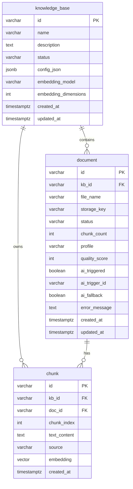

> **已归档**。请以 [开发进度.md](../开发进度.md) 与 [docs/README.md](../README.md) 为准。

# RagChunk 数据库设计文档

## 1. 概述

| 项 | 说明 |
|----|------|
| **数据库** | PostgreSQL 16+ |
| **向量扩展** | [pgvector](https://github.com/pgvector/pgvector) |
| **Schema 管理** | Flyway（`src/main/resources/db/migration`）；Spring Boot 4 须依赖 `spring-boot-starter-flyway` |
| **表注释** | `V2__table_comments.sql`（`COMMENT ON`，可在库内 `\d+ 表名` 查看） |
| **ORM** | MyBatis Plus（`knowledge_base` / `document`）+ JdbcTemplate（`chunk` 向量检索） |
| **默认向量维度** | 1024（与 `text-embedding-v3` / `ragchunk.embedding.dimensions` 一致） |

### 存储模式

| 模式 | 配置 | 说明 |
|------|------|------|
| **postgres**（默认） | `ragchunk.storage.mode=postgres` | 全量持久化 |
| **inmemory** | `ragchunk.storage.mode=inmemory` + profile `inmemory` | 无数据库，仅测试/演示 |

---

## 2. 部署与连接

### 2.1 本机 PostgreSQL 17 + pgvector（默认）

安装扩展见 **[install-pgvector-windows.md](install-pgvector-windows.md)**。

```powershell
scripts\install-pgvector-windows.cmd -PgRoot "D:\AnZhuang\PostgreSQL17"
.\mvnw.cmd spring-boot:run
```

连接：`localhost:5432/ragchunk`，`postgres` / `123`。

**启动报错 `missing table [document]`**：库 `ragchunk` 里还没有 Flyway 建表。请 `.\mvnw.cmd clean compile` 后重新启动（项目已使用 `spring-boot-starter-flyway`）。若曾用脚本手工建表但未生成 `flyway_schema_history`，可删表后重启让 Flyway 迁移，或执行 `scripts\apply-schema-local.ps1` 后删除三张业务表再启动。

**环境变量**：若终端里设过 `RAGCHUNK_DB_PORT=5433`、`RAGCHUNK_DB_USER=ragchunk`（Docker 用），会连错库。本机 PG 请清除或改为 5432 / `postgres` / `123`：

```powershell
Remove-Item Env:RAGCHUNK_DB_PORT, Env:RAGCHUNK_DB_USER, Env:RAGCHUNK_DB_PASSWORD -ErrorAction SilentlyContinue
```

### 2.2 Docker PostgreSQL + pgvector（可选）

**前置**：安装并启动 [Docker Desktop](https://www.docker.com/products/docker-desktop/)（托盘显示 Running）。

```powershell
cd d:\code\RagChunk
.\scripts\start-postgres-docker.ps1
```

或手动：

```powershell
docker compose up -d
docker exec ragchunk-postgres psql -U ragchunk -d ragchunk -c "SELECT extversion FROM pg_extension WHERE extname='vector';"
```

镜像：`pgvector/pgvector:pg16`（已内置 pgvector，无需在本机 PostgreSQL 安装）

**端口冲突**：若本机 PostgreSQL 17 已占用 5432，需先停止 Windows 服务 `postgresql-x64-17`，否则 Docker 无法绑定端口。

### 2.2 连接参数

| 环境变量 | 默认值 | 说明 |
|----------|--------|------|
| `RAGCHUNK_DB_HOST` | `localhost` | 主机 |
| `RAGCHUNK_DB_PORT` | `5432` | 端口 |
| `RAGCHUNK_DB_NAME` | `ragchunk` | 库名 |
| `RAGCHUNK_DB_USER` | `ragchunk` | 用户名 |
| `RAGCHUNK_DB_PASSWORD` | `ragchunk` | 密码 |

JDBC URL（`application.yaml`）：

```text
jdbc:postgresql://localhost:5432/ragchunk
```

### 2.3 启动应用

```powershell
docker compose up -d
.\mvnw.cmd spring-boot:run
```

Flyway 在应用启动时自动执行迁移脚本 `V1__init_schema.sql`。

### 2.4 集成测试（可选）

默认 `.\mvnw.cmd test` 使用 **inmemory** profile，不依赖 Docker。  
验证 PostgreSQL 迁移与连接需 Docker，并设置环境变量：

```powershell
$env:RUN_PG_INTEGRATION = "1"
.\mvnw.cmd test -Dtest=RagChunkPostgresIntegrationTest
```

---

## 3. ER 关系



---

## 4. 表结构说明

### 4.1 `knowledge_base` — 知识库

| 列名 | 类型 | 约束 | 说明 |
|------|------|------|------|
| `id` | VARCHAR(32) | PK | 如 `kb_a1b2c3d4e5f6` |
| `name` | VARCHAR(255) | NOT NULL | 知识库名称 |
| `description` | TEXT | | 描述 |
| `status` | VARCHAR(32) | NOT NULL | 如 `READY` |
| `config_json` | JSONB | NOT NULL | 合并后的 `KnowledgeBaseConfig` 快照 |
| `embedding_model` | VARCHAR(128) | NOT NULL | 入库/检索使用的 Embedding 模型 |
| `embedding_dimensions` | INT | NOT NULL | 向量维度，默认 1024 |
| `created_at` | TIMESTAMPTZ | NOT NULL | 创建时间（UTC） |
| `updated_at` | TIMESTAMPTZ | NOT NULL | 更新时间（UTC） |

**业务说明**：创建知识库时写入 `config_json`；后续检索、切片均读该快照，避免全局配置变更影响历史库。

---

### 4.2 `document` — 文档

| 列名 | 类型 | 约束 | 说明 |
|------|------|------|------|
| `id` | VARCHAR(32) | PK | 如 `doc_xxxxxxxxxxxx` |
| `kb_id` | VARCHAR(32) | FK → `knowledge_base.id` ON DELETE CASCADE | 所属知识库 |
| `file_name` | VARCHAR(512) | NOT NULL | 原始文件名 |
| `storage_key` | VARCHAR(1024) | | 对象存储路径（预留，一期未写文件） |
| `status` | VARCHAR(32) | NOT NULL | `PROCESSING` / `SUCCESS` / `FAILED` |
| `chunk_count` | INT | NOT NULL DEFAULT 0 | 切片数量 |
| `profile` | VARCHAR(64) | | 文档画像：`PLAIN` / `MARKDOWN` 等 |
| `quality_score` | INT | NOT NULL DEFAULT 0 | 规则切片质量分 0–100 |
| `ai_triggered` | BOOLEAN | NOT NULL DEFAULT FALSE | 是否触发千问重切 |
| `ai_trigger_id` | VARCHAR(16) | | 触发编号，如 `T2`、`T8` |
| `ai_fallback` | BOOLEAN | NOT NULL DEFAULT FALSE | 千问失败是否回退规则结果 |
| `error_message` | TEXT | | 失败原因 |
| `created_at` | TIMESTAMPTZ | NOT NULL | 上传时间 |
| `updated_at` | TIMESTAMPTZ | NOT NULL | 最后更新时间 |

**索引**：

- `idx_document_kb_id` (`kb_id`)
- `idx_document_kb_created` (`kb_id`, `created_at DESC`)

---

### 4.3 `chunk` — 切片与向量

| 列名 | 类型 | 约束 | 说明 |
|------|------|------|------|
| `id` | VARCHAR(64) | PK | 切片 ID，如 `{docId}_c0000` |
| `kb_id` | VARCHAR(32) | FK → `knowledge_base.id` ON DELETE CASCADE | 知识库 |
| `doc_id` | VARCHAR(32) | FK → `document.id` ON DELETE CASCADE | 来源文档 |
| `chunk_index` | INT | NOT NULL | 文档内序号，从 0 起 |
| `text_content` | TEXT | NOT NULL | 切片正文 |
| `source` | VARCHAR(64) | | 来源标记（规则/千问） |
| `embedding` | vector(1024) | NOT NULL | pgvector 向量 |
| `created_at` | TIMESTAMPTZ | NOT NULL | 写入时间 |

**约束**：

- `uq_chunk_doc_index`：同一文档内 `chunk_index` 唯一

**索引**：

- `idx_chunk_kb_id` (`kb_id`)
- `idx_chunk_doc_id` (`doc_id`)
- `idx_chunk_embedding`：HNSW 索引，`vector_cosine_ops`（余弦相似度检索）

**检索 SQL（应用内）**：

```sql
SELECT id, kb_id, doc_id, chunk_index, text_content, source,
       1 - (embedding <=> :queryVec) AS score
FROM chunk
WHERE kb_id = :kbId
  AND 1 - (embedding <=> :queryVec) >= :minScore
ORDER BY embedding <=> :queryVec
LIMIT :topK
```

---

## 5. 级联与生命周期

| 操作 | 数据库行为 |
|------|------------|
| 删除知识库 | CASCADE 删除其下 `document`、`chunk` |
| 删除文档 | CASCADE 删除其下 `chunk` |
| 上传失败 | 应用层 `DELETE FROM chunk WHERE doc_id = ?`，文档标记 `FAILED` |
| 应用重启 | 数据保留（与内存模式不同） |

---

## 6. 代码映射

| 表 | Java 实体 / 访问层 |
|----|-------------------|
| `knowledge_base` | `KnowledgeBaseEntity` + `KnowledgeBaseMapper` → `MybatisKnowledgeBaseStore` |
| `document` | `DocumentEntity` + `DocumentMapper` → `MybatisDocumentStore` |
| `chunk` | `PgVectorStore`（JdbcTemplate + `com.pgvector.PGvector`） |

领域模型（`KnowledgeBase`、`DocumentRecord`）与实体互转：`PersistenceMapper`。

---

## 7. 迁移脚本

| 版本 | 文件 | 内容 |
|------|------|------|
| V1 | `db/migration/V1__init_schema.sql` | 启用 `vector` 扩展；创建三表及索引 |

新增变更请追加 `V2__xxx.sql`，勿修改已发布的 V1。

---

## 8. 运维命令

```sql
-- 查看知识库数量
SELECT COUNT(*) FROM knowledge_base;

-- 某库文档与切片统计
SELECT d.id, d.file_name, d.status, d.chunk_count, COUNT(c.id) AS actual_chunks
FROM document d
LEFT JOIN chunk c ON c.doc_id = d.id
WHERE d.kb_id = 'kb_xxxxxxxxxxxx'
GROUP BY d.id, d.file_name, d.status, d.chunk_count;

-- 检查 pgvector 扩展
SELECT * FROM pg_extension WHERE extname = 'vector';
```

---

## 9. 启动报错：`missing table [document]`

**含义**：应用已启动但库里 **没有 Flyway 建好的表**（或连错库）。

**常见原因**：

| 原因 | 处理 |
|------|------|
| 连错库（如连到默认库 `postgres` 而非 `ragchunk`） | 确认 `RAGCHUNK_DB_NAME=ragchunk` 或执行 `init-postgres.sql` |
| Flyway 未执行 / 迁移失败 | 查看日志中 `Flyway` 是否报错；常见为 **未安装 pgvector** |
| 空库首次启动失败后半途改过配置 | 在目标库执行 `db/migration/V1__init_schema.sql` 或 `docker compose up -d` 后重启 |

**自检 SQL**（在目标库执行）：

```sql
SELECT tablename FROM pg_tables WHERE schemaname = 'public' ORDER BY 1;
SELECT * FROM flyway_schema_history;
```

应能看到 `knowledge_base`、`document`、`chunk` 三张表。

---

## 10. 注意事项

1. **维度固定 1024**：修改 `ragchunk.embedding.dimensions` 须同步修改 Flyway 中 `vector(n)` 并重建索引。  
2. **模型一致性**：同一知识库的入库与问答必须使用 `embedding_model` 对应模型。  
3. **HNSW 索引**：数据量极小时可先不建 HNSW，百万级再评估 `lists` / `m` 参数。  
4. **原始文件**：`storage_key` 已预留；一期仍从上传流直接解析，未落对象存储。
