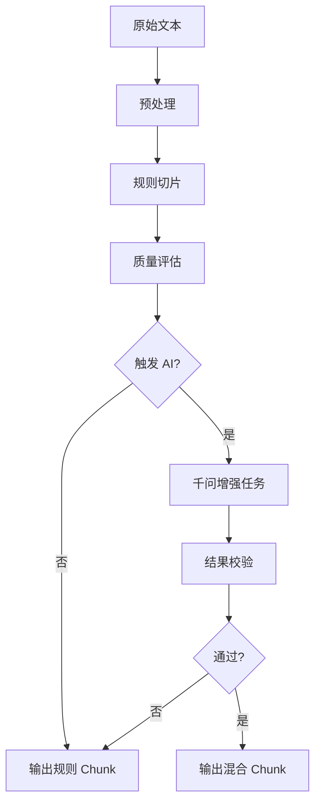
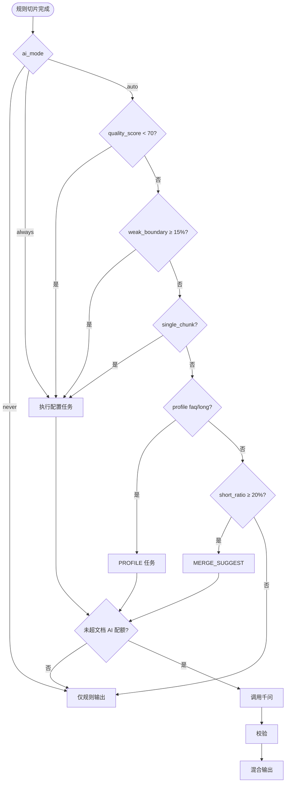

> **已归档**。请以 [开发进度.md](../开发进度.md) 与 [docs/README.md](../README.md) 为准。

# 混合切片方案：规则 + 千问

RagChunk 默认采用 **规则切片为主、千问按需增强** 的混合策略：保证 80%+ 文档零 AI 成本、可复现；仅在规则切片质量不达标或文档类型需要时触发千问。

> 关联：[chunking.md](chunking.md) · 业务活动 KB-02 / KB-06 · [business-process.md](business-process.md)

> **一期裁剪**（仅 T0/T1/T2/T4/T8 + `SEMANTIC_RESPLIT`）见 **[phase1-scope.md](phase1-scope.md)**。

---

## 1. 设计原则

| 原则 | 说明 |
|------|------|
| **规则优先** | 所有文档必须先走完规则流水线，产出基准 Chunk 与质量指标 |
| **按需触发 AI** | 仅当指标越界或命中白名单类型时才调用千问 |
| **任务可枚举** | AI 只做明确任务（重切、合并、摘要、Q&A 钩子等），禁止全文随意改写 |
| **可回退** | AI 结果不满足校验时保留规则切片版本 |
| **成本可控** | 单文档 AI 调用次数、Token 上限可配置 |



---

## 2. 规则切片（主路径）

### 2.1 预处理规则（R0）

| 编号 | 规则 | 说明 |
|------|------|------|
| R0-1 | 统一换行 | `\r\n` → `\n` |
| R0-2 | 空白压缩 | 连续空格/制表符 → 单空格；行首尾 trim |
| R0-3 | 段落归一 | 3 个及以上 `\n` → 2 个 `\n` |
| R0-4 | 可选去 URL/邮箱 | 默认开启；技术文档含 API 地址时可关闭 |
| R0-5 | 结构标记保留 | Markdown 标题行、列表项前缀不删除 |

### 2.2 文档类型识别（R1）

按 **扩展名 + 内容特征** 选择规则 profile（可配置覆盖）：

| Profile | 触发条件 | 分段模式 | 分隔符优先级（依次尝试） |
|---------|----------|----------|---------------------------|
| `markdown` | `.md` 或含 `# ` 标题 | 通用 | `\n## `、`\n### `、`\n\n` |
| `structured` | 含 ≥3 个 `\n#` 或 `\n\d+\.` 章节 | 通用 | `\n## `、`\n\n`、`\n` |
| `faq` | 含 ≥5 组「问/答」「Q:/A:」模式 | 通用 | `\n\n`、`\n` |
| `plain` | 默认 | 通用 | `\n\n`、`\n`。`、`\n` |
| `long_manual` | 字数 > 8000 且 structured | **父子** | 父：`\n## `；子：`\n\n` |

### 2.3 核心切分规则（R2）

| 编号 | 规则 | 参数默认值 | 说明 |
|------|------|------------|------|
| R2-1 | 分隔符切分 | 见 profile | 按优先级选第一个「能产生 ≥2 段」的分隔符 |
| R2-2 | 最大长度 | `max_chars = 1200` | 超限则在句末标点处二次切（见 R2-3） |
| R2-3 | 句边界回退 | `。！？；\n` | 硬切前向前找最近标点，距边界 < 20% max 则在该处切 |
| R2-4 | 最小长度 | `min_chars = 80` | 低于则与相邻段合并（优先向后合并） |
| R2-5 | 重叠 | `overlap = 80` | 相邻段重叠字符数（父子模式下仅子段） |
| R2-6 | 标题附着 | — | Markdown 标题行并入 **下一段** 开头，不单独成段 |
| R2-7 | 代码块原子 | — | ` ``` ` 围栏内不切断；超 max 则整段保留并打标 `type=code` |
| R2-8 | 表格原子 | — | 连续表格行（`\|` 开头）尽量保持同段；超 max 按空行切 |

### 2.4 父子模式规则（R3，profile = long_manual）

| 编号 | 规则 | 参数 |
|------|------|------|
| R3-1 | 父段 | `parent_sep = \n## `，`parent_max = 4000` 字符 |
| R3-2 | 子段 | `child_sep = \n\n`，`child_max = 800`，`child_overlap = 50` |
| R3-3 | 子段下限 | `child_min = 60`，不足则合并到同父子段内 |

### 2.5 规则切片产出

每个 Chunk 附带元数据，供评估与 AI 使用：

```json
{
  "chunk_id": "doc1_c003",
  "text": "...",
  "char_len": 956,
  "source": "rule",
  "profile": "structured",
  "flags": ["has_table", "boundary_weak"],
  "parent_id": null
}
```

---

## 3. 质量评估（规则切片后）

评估不调用 AI，仅基于统计与启发式，输出 `quality_report`。

### 3.1 文档级指标

| 指标 ID | 计算方式 | 健康范围 |
|---------|----------|----------|
| Q1 `chunk_count` | 分段总数 | 2 ≤ n ≤ ceil(总字数/300) |
| Q2 `avg_len` | 平均字符数 | 200 ≤ avg ≤ 1000 |
| Q3 `short_ratio` | 长度 < min_chars 的段占比 | < 10% |
| Q4 `long_ratio` | 长度 > max_chars 的段占比 | 0%（硬切后应为 0） |
| Q5 `weak_boundary_ratio` | 见 3.2 | < 15% |
| Q6 `single_chunk_doc` | 总字数 > 1500 但只有 1 段 | 应为 false |

### 3.2 段级：弱边界判定（`boundary_weak`）

段 **首字符** 或 **尾字符** 满足以下任一，则标记 `boundary_weak`：

- 首字符为 `，、；：）】」` 等续写标点  
- 尾字符为 `（【「` 等未闭合标点  
- 首行不以标题/列表/数字编号开头，但上一段以 `：` 结尾（列表被拦腰切断）  
- 英文单词在段首/段尾被截断（正则：`[a-zA-Z]$` 结尾且下段 `^[a-z]`）

### 3.3 文档级质量分

```
quality_score = 100
  - short_ratio * 40
  - weak_boundary_ratio * 50
  - (single_chunk_doc ? 30 : 0)
  - (long_ratio > 0 ? 20 : 0)
```

`quality_score < 70` → 进入 AI 触发候选。

---

## 4. AI 触发规则（何时调用千问）

### 4.1 触发逻辑总表

| 优先级 | 触发 ID | 条件 | AI 任务 | 可关闭 |
|--------|---------|------|---------|--------|
| P0 | **T0 强制** | 知识库配置 `chunking.ai_mode=always` | 按配置任务 | — |
| P0 | **T1 禁用** | `chunking.ai_mode=never` | 不调用 | — |
| P1 | **T2 质量不达标** | `quality_score < 70` | `SEMANTIC_RESPLIT` | 是 |
| P1 | **T3 弱边界过多** | `weak_boundary_ratio ≥ 15%` | `SEMANTIC_RESPLIT` | 是 |
| P1 | **T4 巨型单段** | `single_chunk_doc=true` 且字数>1500 | `SEMANTIC_RESPLIT` | 是 |
| P2 | **T5 FAQ  profile** | profile=faq 且段数≥3 | `QA_HOOK`（生成子问法） | 是 |
| P2 | **T6 长手册** | profile=long_manual | `PARENT_SUMMARY`（父段摘要） | 是 |
| P3 | **T7 短段堆积** | `short_ratio ≥ 20%` | `MERGE_SUGGEST` | 是 |
| P3 | **T8 用户指定** | 上传时勾选「智能切片」 | 配置的任务组合 | 是 |

**默认模式** `chunking.ai_mode=auto`：满足 T2～T8 任一即触发（T1/T0 除外）。

### 4.2 触发决策流程



### 4.3 成本控制（触发门槛）

| 限制 | 默认值 | 说明 |
|------|--------|------|
| `ai_max_calls_per_doc` | 3 | 单文档最多 3 次千问请求 |
| `ai_max_input_tokens` | 12000 | 单次送入模型的规则段总 token 上限 |
| `ai_max_docs_per_batch` | 20% | 批量入库时仅 20% 文档允许 AI（其余仅规则） |
| `ai_cooldown` | — | 同一文档重处理间隔 ≥ 5 分钟 |

超配额时：**不触发 AI**，记录 `ai_skipped_reason=quota`，仍用规则切片入库。

---

## 5. 千问任务定义（触发后做什么）

### 5.1 任务一览

| 任务码 | 名称 | 输入 | 输出要求 | 适用触发 |
|--------|------|------|----------|----------|
| `SEMANTIC_RESPLIT` | 语义重切 | 全文或劣质段合并文本 | JSON 数组 `[{text, reason}]`，段长 200～1200 | T2,T3,T4 |
| `MERGE_SUGGEST` | 合并建议 | 相邻短段对（≤3 对） | 返回应合并的 `chunk_id` 对 | T7 |
| `QA_HOOK` | 问答钩子 | 每段正文 | 每段 1～3 条「用户可能问法」，写入 `hooks[]` | T5 |
| `PARENT_SUMMARY` | 父段摘要 | 每个父段 | ≤150 字摘要，写入子段检索字段 | T6 |
| `BOUNDARY_FIX` | 边界修复 | 带 `boundary_weak` 的段及上下文 | 仅调整切分点，不删事实 | T3 可选 |

### 5.2 任务优先级（同文档多条件命中）

同一文档只执行 **最高优先级未完成任务**，顺序：

`SEMANTIC_RESPLIT` > `BOUNDARY_FIX` > `MERGE_SUGGEST` > `PARENT_SUMMARY` > `QA_HOOK`

避免一次文档叠加多次大模型调用。

### 5.3 Prompt 约束（共性）

千问输出必须满足：

1. **不得编造** 原文不存在的事实、数字、条款  
2. **保留** 代码块、表格、专有名词原文  
3. 输出 **结构化 JSON**，便于程序校验  
4. 单次输出段数：`ceil(原文字数/400)` ± 20%

### 5.4 SEMANTIC_RESPLIT 示例 Prompt 骨架

```text
你是文档切片助手。根据下列原文，按语义完整性切分为若干段。
要求：每段 200～1200 中文字符；不在句子中间切断；保留标题与列表结构。
仅输出 JSON：{"chunks":[{"text":"..."}]}
原文：
---
{content}
---
```

### 5.5 AI 结果校验（V 规则）

| 编号 | 校验 | 失败处理 |
|------|------|----------|
| V1 | 每段长度 ∈ [min_chars, max_chars * 1.1] | 回退规则切片 |
| V2 | 各段拼接后字符覆盖率 ≥ 95% 原文（去空白） | 回退 |
| V3 | 段数变化率 ≤ 300%（防过度碎片化） | 回退 |
| V4 | JSON 可解析 | 重试 1 次，仍失败则回退 |
| V5 | 无空段、无重复段（相似度>0.95） | 去重或回退 |

通过校验的 Chunk 标记 `source=hybrid`，记录 `ai_task` 与 `ai_trigger_id`。

---

## 6. 推荐配置（按场景）

| 场景 | profile | ai_mode | 默认触发 | 推荐 AI 任务 |
|------|---------|---------|----------|--------------|
| 普通制度/说明 | plain / structured | auto | T2,T3 | SEMANTIC_RESPLIT |
| FAQ | faq | auto | T5 | QA_HOOK |
| 技术手册 | long_manual | auto | T6 + T2 | PARENT_SUMMARY |
| 批量低成本 | plain | never | — | — |
| 高质量小库 | * | always | T0 | SEMANTIC_RESPLIT + QA_HOOK |

---

## 7. application.yaml 配置示例

```yaml
ragchunk:
  chunking:
    mode: hybrid                    # rule | hybrid
    ai-mode: auto                   # never | auto | always
    profile-auto-detect: true

  rule:
    max-chars: 1200
    min-chars: 80
    overlap: 80
    parent-max-chars: 4000
    child-max-chars: 800
    long-doc-threshold: 8000        # 字数 > 此值考虑 long_manual

  quality:
    score-threshold: 70             # T2
    weak-boundary-ratio-threshold: 0.15
    short-ratio-threshold: 0.20

  ai:
    model: qwen-plus
    max-calls-per-doc: 3
    max-input-tokens: 12000
    tasks-on-auto:
      - SEMANTIC_RESPLIT
      - MERGE_SUGGEST
      - QA_HOOK
      - PARENT_SUMMARY
    retry-on-parse-error: 1
```

---

## 8. 与检索的衔接

| 产出 | 检索用法 |
|------|----------|
| 规则/混合 Chunk 正文 | 主向量字段 |
| `QA_HOOK` | 额外写入 `hook_text`，检索时与正文并集或加权 |
| `PARENT_SUMMARY` | 写入子段 `summary`，摘要命中返回父段（父子模式） |
| `type=code` | 可选单独降权或仅关键词检索 |

---

## 9. 实现检查清单（研发）

- [ ] `ChunkProfileDetector`：R1 类型识别  
- [ ] `RuleChunker`：R0～R3  
- [ ] `ChunkQualityEvaluator`：Q1～Q6、quality_score  
- [ ] `AiChunkTrigger`：T0～T8 + 配额  
- [ ] `QwenChunkTasks`：五类任务 + Prompt 模板  
- [ ] `ChunkValidationService`：V1～V5  
- [ ] 处理日志：`trigger_id`、`ai_task`、`fallback_reason`  

---

## 10. 修订记录

| 版本 | 日期 | 说明 |
|------|------|------|
| v1.0 | 2026-05-19 | 初版：规则集 R0～R3、触发 T0～T8、任务与校验 |
| v1.1 | 2026-05-19 | 新增 [phase1-scope.md](phase1-scope.md) 一期千问切片裁剪说明 |
