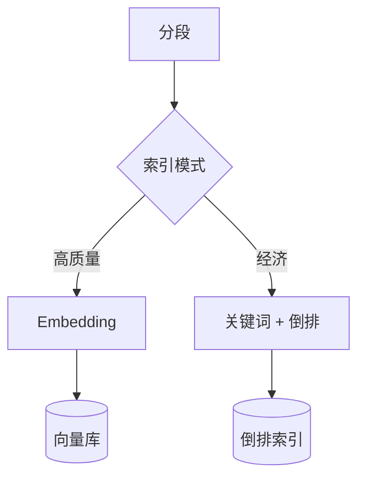

> **已归档**。请以 [开发进度.md](../开发进度.md) 与 [docs/README.md](../README.md) 为准。

# 索引模式（Indexing）

索引决定 **分段如何被存储以便检索**；检索策略决定 **用户提问时如何查找**。

参考：向量索引与检索设置（外部产品文档不在此维护链接）  
业务活动：**KB-03**（见 [business-process.md](business-process.md)）

## 1. 两种索引方式

| | 高质量 | 经济 |
|---|--------|------|
| **原理** | Embedding 向量化 | 每段约 10 关键词 + 倒排 |
| **成本** | 消耗 Embedding Token | 几乎不耗 Embedding |
| **准确度** | 高；语义、跨语言 | 偏低；偏关键词 |
| **创建后** | 不可降为经济 | 可升级为高质量 |
| **父子分段** | 支持 | **不支持** |
| **多模态** | 可选 Vision 嵌入 | 不涉及 |

RagChunk **一期**：高质量 + 本地向量库；经济模式二期。

## 2. 高质量：检索策略

| 策略 | 机制 | 适用 |
|------|------|------|
| **向量检索** | Query 与 Chunk 向量相似度 | 同义、语义、多语言 |
| **全文检索** | 关键词 / 倒排 | 型号、法规号、确切词 |
| **混合检索** | 向量 + 全文再融合 | 语义 + 关键词兼顾 |

### 2.1 混合权重（无需 Rerank API）

| 设置 | 效果 |
|------|------|
| 语义 = 1 | 纯向量 |
| 关键词 = 1 | 纯全文 |
| 自定义比例 | 业务调优 |

### 2.2 Rerank

对第一轮候选精排，见 [retrieval.md](retrieval.md)。

## 3. 经济模式（规划）

- 倒排 + TopK  
- 分段最多 **10 个关键词**  
- 无混合权重条  

## 4. Q&A 模式（可选）

- 每段生成问答对，**Q 匹配 Q** 再返回段  
- 适合 FAQ；可用千问批量生成  

## 5. Embedding 与千问

| 环节 | 用途 |
|------|------|
| 入库 | DashScope Embedding 对每个 Chunk 向量化 |
| 查询 | **同一模型** 对 User Query 向量化 |
| 生成 | qwen-plus / turbo 等，**不替代** Embedding |

## 6. 场景选型

| 场景 | 索引 | 检索 |
|------|------|------|
| 通用知识库 | 高质量 | 向量或混合 |
| 强专有名词 | 高质量 | 混合，提高关键词权重 |
| 成本极敏感 | 经济（二期） | 倒排 TopK |
| 长文档要上下文 | 高质量 + 父子 | 向量 + 可选 Rerank |

## 7. 与检索参数

索引选定后，问答阶段使用 [retrieval.md](retrieval.md) 中的 TopK、阈值、Rerank。
