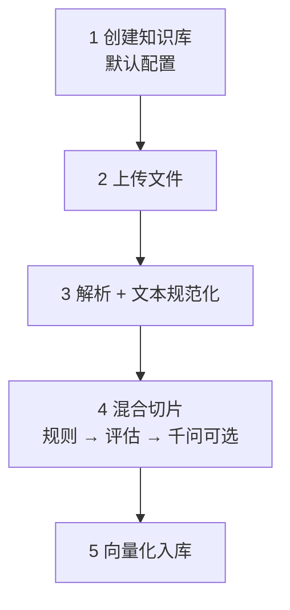

> **已归档**。主文档见 [README.md](../../README.md)。

# 一期范围：离线建库 + 千问切片

一期在 **简化离线流程** 的前提下 **保留混合切片（规则 + 千问按需）**，不做父子模式、经济索引、PDF、Rerank 等。

> 完整规则见 [hybrid-chunking.md](hybrid-chunking.md)；本文为 **一期裁剪版**。

---

## 1. 一期离线流程（5 步）



| 步骤 | 一期内容 | 不做 |
|------|----------|------|
| 1 创建知识库 | 名称 + 全局默认（切片/TopK）；`ai_mode` 默认 `auto` | 分步向导、per-doc 切片配置 |
| 2 上传 | TXT、MD、DOCX | PDF、Notion、网页 |
| 3 解析+规范化 | 合并原「解析+清洗」；R0-1～R0-3 | 去 URL（R0-4 关闭） |
| 4 混合切片 | 规则 R2 + 质量评估 + 千问（见 §2） | 父子 R3、五 profile |
| 5 向量化入库 | DashScope Embedding + 本地向量库 | 关键词倒排、多模态 |

**处理状态**：`PROCESSING` / `SUCCESS` / `FAILED`（三态）。

---

## 2. 一期千问切片：保留什么、砍掉什么

### 2.1 保留（必须实现）

| 能力 | 一期范围 |
|------|----------|
| 规则切片 | `plain` + `markdown` 两 profile；R2-1～R2-5（无代码/表格原子） |
| 质量评估 | Q1、Q3、Q5、Q6 + `quality_score`（可去掉 Q2、Q4 权重简化） |
| AI 模式 | `auto`（默认）、`never`、`always` |
| 触发条件 | **T2**、**T4**、**T8**（见下表） |
| AI 任务 | 仅 **`SEMANTIC_RESPLIT`** |
| 校验 | **V1、V2、V4**（长度、覆盖率、JSON） |
| 回退 | 校验失败 → 规则切片结果入库 |
| 配额 | `max_calls_per_doc=1`，`max_input_tokens=8000` |

### 2.2 一期不做（二期）

| 能力 | 原因 |
|------|------|
| T3、T5、T6、T7 | 合并进 T2/T4 或 profile 二期再做 |
| `MERGE_SUGGEST`、`QA_HOOK`、`PARENT_SUMMARY`、`BOUNDARY_FIX` | 任务多、联调成本高 |
| 父子模式 R3 | 检索链路复杂 |
| profile `faq` / `long_manual` / `structured` | 一期仅扩展名区分 md/其他 |
| `ai_max_docs_per_batch` 20% | 一期单库量小，仅 per-doc 配额 |

---

## 3. 一期触发规则（精简版）

| 触发 ID | 条件 | 任务 | 默认 |
|---------|------|------|------|
| **T1** | `ai_mode=never` | 无 | — |
| **T0** | `ai_mode=always` | SEMANTIC_RESPLIT | — |
| **T2** | `ai_mode=auto` 且 `quality_score < 70` | SEMANTIC_RESPLIT | ✅ |
| **T4** | `ai_mode=auto` 且 字数>1500 且仅 1 段 | SEMANTIC_RESPLIT | ✅ |
| **T8** | 上传参数 `smartChunk=true` | SEMANTIC_RESPLIT（优先于 T2/T4 判断） | ✅ |

**决策顺序**（`auto` 模式）：

```text
never → 规则输出
always → 千问重切
smartChunk=true → 千问重切（全文，受 token 上限截断）
quality_score < 70 或 single_chunk → 千问重切
否则 → 规则输出
```

**一期不实现**：T3 单独触发（已并入 quality_score）、T5～T7。

### 3.1 质量分一期公式（简化）

```text
quality_score = 100
  - short_ratio * 40
  - weak_boundary_ratio * 50
  - (single_chunk_doc ? 30 : 0)
```

去掉 `long_ratio` 项（规则硬切后应为 0）。

---

## 4. 一期规则切片参数（固定默认）

| 参数 | 值 |
|------|-----|
| `max_chars` | 1200 |
| `min_chars` | 80 |
| `overlap` | 80 |
| `plain` 分隔符 | `\n\n` → `\n` |
| `markdown` 分隔符 | `\n## ` → `\n\n` → `\n` |
| 句边界回退 R2-3 | 开启 |

---

## 5. 千问 SEMANTIC_RESPLIT（一期）

### 5.1 输入策略

| 场景 | 送入千问的内容 |
|------|----------------|
| T4 / 巨型单段 | 全文（超 8000 token 则按 `\n\n` 先粗切再拼接前 N 字，并记录 `truncated=true`） |
| T2 / 质量差 | 全文；或 `weak_boundary` 段及其前后各 1 段拼接（全文更短时用全文） |
| T8 / 用户勾选 | 同 T4 |

### 5.2 输出与校验

- 输出 JSON：`{"chunks":[{"text":"..."}]}`  
- **V1**：每段 80～1320 字符  
- **V2**：合并段去空白后长度 ≥ 原文 95%  
- **V4**：JSON 合法，失败重试 1 次  

### 5.3 模型与调用

- 切片用 **`qwen-plus`**（或 `qwen-turbo` 降本），与问答模型可同厂商不同模型名  
- Embedding 仍用 **`text-embedding-v3`** 等，**不与切片共用 chat 模型**

---

## 6. 配置（一期 application.yaml）

```yaml
ragchunk:
  phase: 1

  chunking:
    mode: hybrid
    ai-mode: auto              # never | auto | always

  rule:
    max-chars: 1200
    min-chars: 80
    overlap: 80

  quality:
    score-threshold: 70

  ai:
    chunk-model: qwen-plus     # 切片专用
    max-calls-per-doc: 1
    max-input-tokens: 8000
    retry-on-parse-error: 1
    tasks:
      - SEMANTIC_RESPLIT       # 一期仅此任务

  embedding:
    model: text-embedding-v3

  retrieval:
    top-k: 3
    score-threshold: 0.5
```

---

## 7. 模块实现顺序（研发）

| 顺序 | 模块 | 说明 |
|------|------|------|
| 1 | `TextNormalizer` | R0-1～R0-3 |
| 2 | `RuleChunker` | plain/markdown + R2 |
| 3 | `ChunkQualityEvaluator` | 简化 quality_score |
| 4 | `AiChunkTrigger` | T0/T1/T2/T4/T8 |
| 5 | `QwenSemanticResplitClient` | DashScope + Prompt + V1/V2/V4 |
| 6 | `ChunkIngestPipeline` | 串联 3→4→5，写 `source=rule|hybrid` |
| 7 | `EmbeddingService` + `VectorStore` | 对最终 Chunk 列表 embed |
| 8 | 上传 API | `smartChunk` 查询参数 |

### 7.1 处理日志字段（便于排查）

```text
doc_id, profile, chunk_count, quality_score,
ai_triggered, ai_trigger_id, ai_task, ai_fallback, ai_tokens
```

---

## 8. 与「一期不做千问」的差异

| 项 | 无千问 MVP | **一期（本文）** |
|----|------------|------------------|
| 离线步骤 | 4 | **5**（切片内含 AI） |
| 切片 | 仅规则 | **规则 + 按需千问重切** |
| 触发 | 无 | **T2/T4/T8 + always/never** |
| 依赖 | 仅 Embedding API | Embedding + **Chat（切片）** |
| 风险 | 劣质文档检索差 | 需配额、回退、日志 |

---

## 9. 相关文档

- [hybrid-chunking.md](hybrid-chunking.md) — 完整版触发与任务（二期对齐）
- [rag-flow.md](rag-flow.md) — 标准 8 步与一期 5 步对照
- [architecture.md](architecture.md) — 模块划分
