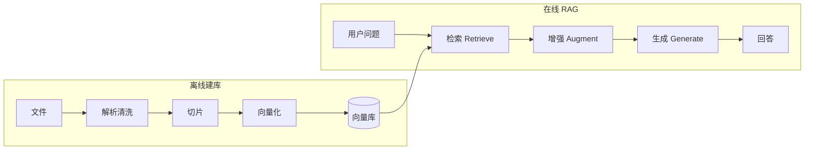
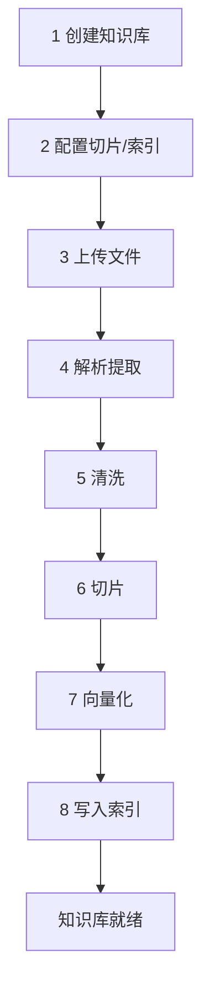

> **已归档**。主文档见 [README.md](../../README.md)。

# 标准 RAG 流程

本文描述 RagChunk 采用的 **标准检索增强生成（RAG）** 全流程：分为 **离线建库**、**在线问答** 两条链路，以及贯穿其中的 **检索 → 增强 → 生成** 三阶段。

> 业务流程视角（角色、场景、验收）见 [business-process.md](business-process.md)。

---

## 一、流程总览表

| 链路 | 阶段 | 步骤序号 | 步骤名称 | 输入 | 输出 | 是否调用 LLM |
|------|------|----------|----------|------|------|----------------|
| **离线** | 准备 | 1 | 创建知识库 | 业务配置 | 知识库元数据 | 否 |
| **离线** | 准备 | 2 | 配置切片与索引 | 分段/索引策略 | 建库参数 | 否 |
| **离线** | 入库 | 3 | 上传文件 | 原始文件 | 文件记录 | 否 |
| **离线** | 入库 | 4 | 解析提取 | 二进制文件 | 纯文本 | 否 |
| **离线** | 入库 | 5 | 清洗（可选） | 纯文本 | 规范化文本 | 否 |
| **离线** | 入库 | 6 | 切片 | 文本 + 切片规则 | Chunk 列表 | 可选（千问增强） |
| **离线** | 入库 | 7 | 向量化 | Chunk 列表 | 向量 + 元数据 | 否（Embedding API） |
| **离线** | 入库 | 8 | 写入索引 | 向量 + Chunk | 可检索知识库 | 否 |
| **在线** | 检索 | 9 | 接收用户问题 | 自然语言问题 | Query 文本 | 否 |
| **在线** | 检索 | 10 | Query 向量化 | 用户问题 | Query 向量 | 否（Embedding API） |
| **在线** | 检索 | 11 | 相似度检索 | Query 向量 | 候选 Chunk | 否 |
| **在线** | 检索 | 12 | 过滤与截断 | 候选 + TopK/阈值 | 命中 Chunk | 否 |
| **在线** | 检索 | 13 | Rerank（可选） | 问题 + 候选 | 重排后 Chunk | 可选（Rerank API） |
| **在线** | 增强 | 14 | 组装上下文 | 命中 Chunk + 问题 | Prompt | 否 |
| **在线** | 生成 | 15 | LLM 生成 | Prompt | 最终回答 | 是（千问） |

---

## 二、RAG 三阶段对照表

| RAG 阶段 | 英文 | 在线步骤 | 做什么 | 依赖离线产物 |
|----------|------|----------|--------|----------------|
| **检索** | Retrieve | 9～13 | 从知识库找出与问题最相关的 Chunk | 向量库、Chunk 文本、检索配置 |
| **增强** | Augment | 14 | 把检索结果嵌入 Prompt | 在线命中结果 |
| **生成** | Generate | 15 | LLM 依据上下文生成答案 | 千问等生成模型 |



---

## 三、离线建库流程表（Ingest）

> **一期实现**（含千问切片、5 步简化版）见 [phase1-scope.md](phase1-scope.md)。

| 序号 | 步骤 | 说明 | 关键配置 / 产出 |
|------|------|------|-----------------|
| 1 | 创建知识库 | 注册逻辑知识容器 | 名称、描述、权限 |
| 2 | 配置切片与索引 | 切分与存储、检索策略 | 见 [chunking.md](chunking.md)、[indexing.md](indexing.md) |
| 3 | 上传文件 | 纳入原始文档 | PDF、DOCX、TXT、MD 等 |
| 4 | 解析提取 | 抽取可读正文 | 版面、表格、编码 |
| 5 | 清洗 | 去噪（可跳过） | 空白、URL、页眉页脚 |
| 6 | 切片 | 拆成 Chunk | 规则为主，千问可选 |
| 7 | 向量化 | Chunk → 向量 | **与查询同一 Embedding 模型** |
| 8 | 写入索引 | 持久化 | 本地向量库；可选倒排 |



### 3.1 一期离线流程（5 步，含千问切片）

| 序号 | 步骤 | 千问 |
|------|------|------|
| 1 | 创建知识库（默认配置，`ai_mode=auto`） | 否 |
| 2 | 上传 TXT/MD/DOCX | 否 |
| 3 | 解析 + 文本规范化 | 否 |
| 4 | **混合切片**：规则 → 质量评估 → 按需 `SEMANTIC_RESPLIT` | **是** |
| 5 | 向量化入库 | 否（仅 Embedding） |

---

## 四、在线问答流程表（Query）

| 序号 | 步骤 | 所属阶段 | 说明 | 关键参数 |
|------|------|----------|------|----------|
| 9 | 接收用户问题 | — | API/界面传入 Query | — |
| 10 | Query 向量化 | 检索 | 与入库相同 Embedding | Embedding 模型 |
| 11 | 相似度检索 | 检索 | ANN / 混合检索 | 向量/全文/混合 |
| 12 | 过滤与截断 | 检索 | 阈值 + TopK | 见 [retrieval.md](retrieval.md) |
| 13 | Rerank（可选） | 检索 | 候选精排 | Rerank 开关 |
| 14 | 组装上下文 | 增强 | Prompt 模板 | 引用格式 |
| 15 | LLM 生成 | 生成 | 千问生成回答 | 模型、温度、max_tokens |

---

## 五、流程说明

### 5.1 离线 / 在线分离

| 链路 | 频率 | 特点 |
|------|------|------|
| **离线** | 低 | 解析、批量向量化；可异步 |
| **在线** | 高 | 检索 + 一次生成；低延迟 |

### 5.2 关键约束

| 约束 | 原因 |
|------|------|
| 入库与查询 **同一 Embedding** | 向量空间须一致 |
| 检索配置在 **问答时** 生效 | TopK、阈值、Rerank 用于步骤 11～13 |
| 生成模型 ≠ Embedding | 前者写答案，前者找资料 |

### 5.3 端到端一句话

> **离线**把文档变成「可搜的 Chunk + 向量」；**在线**搜出相关 Chunk，塞进 Prompt，再让千问 **有据可依** 地回答。

---

## 六、伪代码（实现参考）

```text
# 离线
chunks = chunk(clean(parse(upload(file))), chunkConfig)
for c in chunks:
    vectorStore.upsert(c.id, embed(c.text), c)

# 在线
candidates = vectorStore.search(embed(question), limit=recallSize)
if rerankEnabled:
    candidates = rerank(question, candidates)
filtered = [c for c in candidates if c.score >= threshold]
final = filtered[:topK]
answer = qwenChat(buildPrompt(final, question))
```

---

## 七、相关文档

| 文档 | 说明 |
|------|------|
| [business-process.md](business-process.md) | 业务流程、活动编号 KB/QA/OP |
| [architecture.md](architecture.md) | 模块划分、与 Dify 对照 |
| [chunking.md](chunking.md) | 步骤 6 |
| [indexing.md](indexing.md) | 步骤 2、7、11 |
| [retrieval.md](retrieval.md) | 步骤 12、13 |
