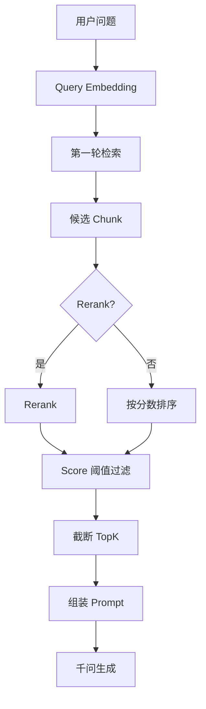

> **已归档**。主文档见 [README.md](../../README.md)。

# 检索参数：TopK、相似度阈值、Rerank

作用于 **用户提问 → 召回 Chunk → 送入 LLM**（在线步骤 11～13）。

参考：[Dify - 指定检索设置](https://docs.dify.ai/zh/use-dify/knowledge/create-knowledge/setting-indexing-methods#指定检索设置)  
业务活动：**KB-03**、**QA-03**、**QA-04**（见 [business-process.md](business-process.md)）

## 1. 整体流水线



## 2. TopK

**定义**：最多返回 **K 条** 分段给 LLM。

| 要点 | 说明 |
|------|------|
| 默认参考 | Dify 默认 **3** |
| 越大 | 上下文更全，噪音与 token 增加 |
| 越小 | 更精炼，可能漏信息 |

**与阈值**：TopK = 数量上限；阈值 = 质量下限。

### RagChunk 建议顺序

```
候选集（如 20 条）
  → [可选] Rerank
  → score >= 阈值
  → 取前 TopK
```

## 3. 相似度阈值（Score Threshold）

**定义**：分数 **低于阈值** 的 Chunk 丢弃。

| 阈值 | 效果 |
|------|------|
| 偏高（0.7） | 更严，易漏答 |
| 偏低（0.3） | 更松，易带噪音 |
| Dify 参考 | **0.5** |

分数来源：向量余弦、混合融合分、或 Rerank 分；实现时需统一标度。

## 4. Rerank（重排序）

| 对比 | 第一轮 | Rerank |
|------|--------|--------|
| 目标 | 快、召回广 | 准、精排 |
| 成本 | Embedding | 额外 API |

**何时启用**：多库合并、向量「像但不对」、愿付延迟与费用。  
**何时省略**：单库、质量高、用混合 **权重** 代替。

### 与混合权重的区别

| 能力 | 混合权重 | Rerank |
|------|----------|--------|
| 阶段 | 第一轮融合 | 第二轮精排 |
| 成本 | 低 | 较高 |

## 5. 调参速查

| 现象 | 建议 |
|------|------|
| 胡编、答非所问 | ↑ 阈值，↓ TopK，或开 Rerank |
| 总说找不到 | ↓ 阈值，略 ↑ TopK |
| 专有名词搜不到 | 混合 + ↑ 关键词权重 |
| 延迟/成本高 | 关 Rerank，TopK=3～5 |

## 6. 伪代码

```text
queryVec = embed(userQuestion)
candidates = vectorStore.search(queryVec, limit=20)

if rerankEnabled:
    candidates = rerank(userQuestion, candidates)

filtered = [c for c in candidates if c.score >= scoreThreshold]
final = filtered[:topK]

answer = qwenChat(buildPrompt(final, userQuestion))
```

## 7. 配置示例

```yaml
retrieval:
  top-k: 3
  score-threshold: 0.5
  rerank:
    enabled: false
  hybrid:
    semantic-weight: 0.7
    keyword-weight: 0.3
```

## 8. 相关文档

- [rag-flow.md](rag-flow.md)  
- [indexing.md](indexing.md)  
- [business-process.md](business-process.md) §9.3 常见问题
