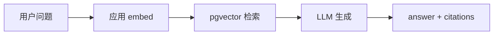
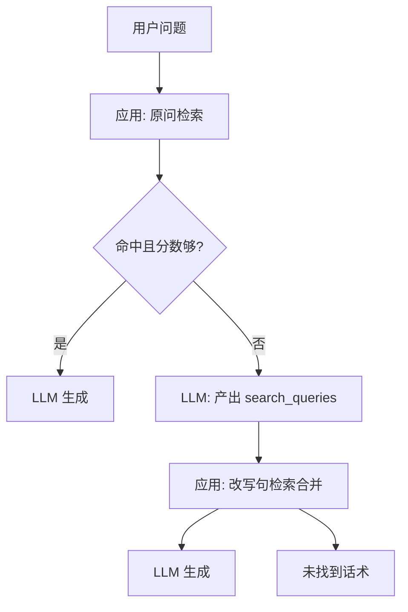
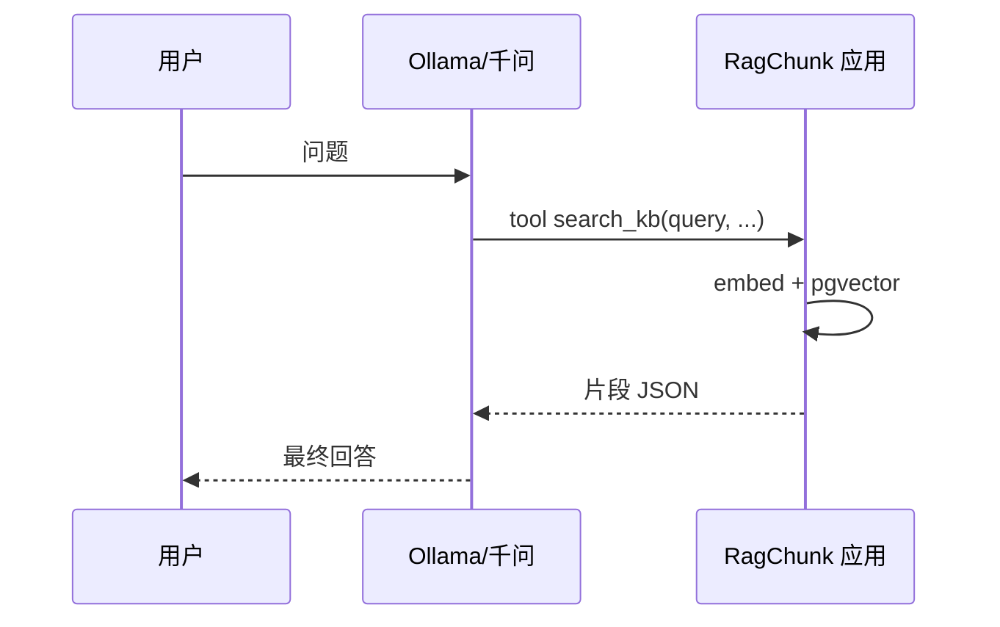

# 智能问答方案说明

| 项 | 内容 |
|----|------|
| 接口 | `POST /api/v1/knowledge-bases/{kbId}/chat` |
| 编排入口 | `ChatOrchestrator` |
| 日志前缀 | `[智能问答]` |
| 更新日期 | 2026-05-22 |

本文以 **方案名称** 描述编排方式；接口与配置中的 `scheme` / `qaScheme` 仍为数字编码（与 `meta.schemeName` 一一对应），见下文「编码对照」。

---

## 1. 实现与测试状态

### 1.1 已实现 · 已测试

以下四种编排 **代码已落地**，并完成 **HTTP 联调**（`scripts/test-qa-schemes.ps1`：建库 → 上传 → 轮询入库 → 四种 `qaScheme` 调用 `chat`，校验状态码与 `meta` 字段）。

| 方案名称 | API 标识 `schemeName` | 配置/请求编码 | 简要说明 |
|----------|----------------------|---------------|----------|
| **纯应用流水线** | `pipeline` | `1` | 原问向量化 → pgvector 检索 → LLM 生成；延迟最低 |
| **协作渐进检索** | `collaborative_progressive` | `2` | 先用原问检索；命中不足再由 LLM 改写检索句后二轮检索（**生产推荐**） |
| **协作全量改写** | `collaborative_always` | `3` | 每条问答先经 LLM 产出检索句，再检索与生成；适合口语、指代多的问法 |
| **Agent 工具检索** | `agent` | `5` | LLM 通过 `search_kb` 工具多轮检索（次数受 `agentMaxIterations` 等约束） |

**已测范围**：接口可用性、`meta`（`schemeName`、`llmCalls`、`searchRounds`、`rewriteTriggered` 等）、无 LLM 时的降级与固定「未找到」话术。

**尚未充分验收**（仍属「已实现」但不算业务测试通过）：回答准确度、引用是否贴切；在 **未配置** DashScope / Ollama 时 `llmCalls` 常为 `0`（仅检索或离线摘要）；Agent 在真实 Ollama `tools` 环境下的多轮行为需用 `local,ollama` profile 单独验证。

### 1.2 未实现 · 未测试

| 方案名称（规划） | 说明 |
|------------------|------|
| **双层渐进检索** | 在「协作渐进」基础上，由应用在首轮未命中时 **自动放宽相似度阈值** 做二次检索，再决定是否改写。当前 **无对应 `scheme` 编码**；可用 **协作渐进检索** 并调低 `rewriteMinScore`、`retrieval.scoreThreshold` 做近似。 |

以下能力 **不在** 本问答编排范围内，亦 **未实现、未测试**：回答流式输出（SSE）、多轮会话记忆、Rerank 精排、关键词与经济索引混合检索。

---

## 2. 方案说明

### 2.1 纯应用流水线（`pipeline`）

**做什么**：应用侧完成「向量化 → 向量库检索 → 拼装上下文 → LLM 生成」，LLM **不参与** 检索语句改写。

**适用**：问法与文档用语接近、追求低延迟与高 QPS；库内切片质量已较好。

**流程**：



**主要参数**：`retrieval.topK`、`retrieval.scoreThreshold`（见 [创建知识库接口参数.md](创建知识库接口参数.md)）。

---

### 2.2 协作渐进检索（`collaborative_progressive`）

**做什么**：先用 **原问** 检索；若最高分低于 `rewriteMinScore` 或命中不足，再调用 LLM 生成 1～`maxRewriteQueries` 条检索短句，由应用执行第二轮检索并合并结果，最后生成答案。改写与检索轮次受 `maxLlmCalls`、`maxSearchRounds` 限制。

**适用**：生产默认推荐；多数问题只走一轮检索，难问才多一次 LLM。

**流程**：



**主要参数**：`qa.rewriteMinScore`（默认 `0.35`）、`maxRewriteQueries`、`maxLlmCalls`、`maxSearchRounds`。

---

### 2.3 协作全量改写（`collaborative_always`）

**做什么**：**每次** 问答都先经 LLM 将用户问题改写为检索短句，再由应用检索；不区分「首轮是否已够好」。仍受 `maxLlmCalls`、`maxSearchRounds` 上限约束。

**适用**：用户问法口语化、指代多（如「他上周说的那个」）；可接受每次多至少 1 次 LLM 调用。

**与协作渐进的区别**：渐进版 **能省则省**（原问够好则不改写）；全量版 **总是改写** 再搜。

---

### 2.4 Agent 工具检索（`agent`）

**做什么**：LLM 在对话中按需调用应用提供的 **`search_kb`** 工具；应用在工具内执行 embed + pgvector，**不把数据库暴露给模型**。轮次 ≤ `agentMaxIterations`，每轮 tool 次数 ≤ `agentMaxToolCallsPerRound`。

**适用**：探索式、需多步查库或换关键词的复杂问法；**必须** 配置可用的 LLM（Ollama OpenAI 兼容 `/v1` 或 DashScope）。未配置 LLM 时编排 **回退** 为纯应用流水线。

**流程**：



**`search_kb` 工具参数**（由应用校验后执行）：

| 参数 | 必填 | 约束 |
|------|------|------|
| `query` | 是 | 检索短句，≤500 字 |
| `topK` | 否 | 1–10，默认用库 `retrieval.topK` |
| `scoreThreshold` | 否 | 0–1，默认用库阈值 |
| `relaxThreshold` | 否 | `true` 时阈值 ×0.8（需 `agentAllowRelaxThreshold=true`） |

---

## 3. 编码对照（配置与 API）

创建库 `qa.scheme`、请求体 `qaScheme`、响应 `meta.scheme` 使用 **数字**；`meta.schemeName` 为稳定英文标识。

| 编码 | `schemeName` | 方案名称 |
|------|--------------|----------|
| `1` | `pipeline` | 纯应用流水线 |
| `2` | `collaborative_progressive` | 协作渐进检索 |
| `3` | `collaborative_always` | 协作全量改写 |
| `5` | `agent` | Agent 工具检索 |

非法编码（如 `4`）返回 **HTTP 400**。

---

## 4. 配置

### 4.1 全局默认（`application-optional.yaml`）

```yaml
ragchunk:
  qa:
    scheme: 1   # 对应「纯应用流水线」
    rewrite-min-score: 0.35
    max-rewrite-queries: 2
    max-llm-calls: 2
    max-search-rounds: 2
    agent-max-iterations: 3
    agent-max-tool-calls-per-round: 1
    agent-allow-relax-threshold: true
```

### 4.2 知识库快照（`config_json.qa`）

创建库时传入 `qa` 块，写入 `knowledge_base.config_json`；之后问答默认使用该快照。

| 字段 | 类型 | 默认 | 说明 |
|------|------|------|------|
| `scheme` | int | `1` | 见上表编码对照 |
| `rewriteMinScore` | double | `0.35` | **协作渐进检索**：最高分低于此值触发改写 |
| `maxRewriteQueries` | int | `2` | 改写产出检索句上限（1–5） |
| `maxLlmCalls` | int | `2` | 单次问答 LLM 调用上限（1–5） |
| `maxSearchRounds` | int | `2` | 单次问答检索轮次上限（1–5） |
| `agentMaxIterations` | int | `3` | **Agent 工具检索**：对话轮次（1–10） |
| `agentMaxToolCallsPerRound` | int | `1` | **Agent**：每轮 `search_kb` 次数（1–3） |
| `agentAllowRelaxThreshold` | boolean | `true` | **Agent**：是否允许 tool 放宽阈值 |

与 `retrieval.topK`、`retrieval.scoreThreshold` 配合使用（见 [创建知识库接口参数.md](创建知识库接口参数.md)）。

### 4.3 单次请求覆盖

```json
{
  "question": "张衡 5 月周报里软件部有什么进展？",
  "qaScheme": 2
}
```

`qaScheme` 优先于库配置；响应 `meta.schemeName` 为实际执行的方案标识。

### 4.4 按场景推荐

| 场景 | 建议 `scheme` / 方案 | 其它要点 |
|------|----------------------|----------|
| 性能优先 | `1` · 纯应用流水线 | `topK=3`, `scoreThreshold=0.5` |
| 平衡（推荐） | `2` · 协作渐进检索 | `rewriteMinScore=0.35` |
| 召回优先 | `2` 或 `3` | `topK=5`, `scoreThreshold=0.45` |
| Agent 试验 | `5` · Agent 工具检索 | 需 Ollama/千问；`agentMaxIterations=3` |

样例库配置：[create-knowledge-base-request-scheme2.json](api-samples/create-knowledge-base-request-scheme2.json)（协作渐进）、[create-knowledge-base-request-agent.json](api-samples/create-knowledge-base-request-agent.json)（Agent）。

---

## 5. 请求与响应

### 5.1 请求

```http
POST /api/v1/knowledge-bases/{kbId}/chat
Content-Type: application/json

{
  "question": "离线建库流程大致怎样？",
  "qaScheme": 2
}
```

| 字段 | 必填 | 说明 |
|------|------|------|
| `question` | 是 | 用户自然语言问题 |
| `qaScheme` | 否 | 编码 `1` / `2` / `3` / `5`，覆盖库 `qa.scheme` |

样例：[api-samples/chat-request-sample.json](api-samples/chat-request-sample.json)

### 5.2 响应

```json
{
  "answer": "...",
  "citations": [
    {
      "chunkId": "doc_xxx_c0001",
      "docId": "doc_xxx",
      "chunkIndex": 1,
      "score": 0.72,
      "excerpt": "..."
    }
  ],
  "meta": {
    "scheme": 2,
    "schemeName": "collaborative_progressive",
    "llmCalls": 2,
    "searchRounds": 2,
    "rewriteTriggered": true,
    "hitCount": 3,
    "maxScore": 0.68
  }
}
```

| `meta` 字段 | 说明 |
|-------------|------|
| `scheme` / `schemeName` | 数字编码与英文标识（解读时 **以 `schemeName` 为准**） |
| `llmCalls` | LLM HTTP 调用次数 |
| `searchRounds` | 向量检索轮次 |
| `rewriteTriggered` | 是否走过 Query 改写（协作渐进/全量） |
| `hitCount` / `maxScore` | 最终命中条数与最高分 |

无命中且未生成时，`answer` 为固定话术（不调生成 LLM）。

样例：[api-samples/chat-response-sample.json](api-samples/chat-response-sample.json)

---

## 6. 代码模块

| 类 | 职责 |
|----|------|
| `RagChatService` | 入口校验，委托编排 |
| `ChatOrchestrator` | 按 `QaScheme` 分支执行 |
| `ChatRetrievalService` | embed + search + 合并 |
| `QueryRewriteService` | 协作渐进 / 协作全量：改写检索句 |
| `AnswerGenerationService` | 片段 + 原问生成 |
| `KbSearchToolExecutor` | Agent：`search_kb` 执行 |
| `DashScopeHttpClient.chatWithTools` | Agent HTTP |

---

## 7. 与文档入库的关系

| 项 | 说明 |
|----|------|
| 入库 | `ChunkIngestPipeline`，日志 `[文档上传]` |
| 问答 | `ChatOrchestrator`，日志 `[智能问答]` |
| Embedding | 问答与入库共用库快照 `embedding.model` |
| 切片配置 | `chunking` / `rule` 等 **仅影响上传**，不改变 `qa.scheme` |

---

## 8. 相关文档

- [创建知识库接口参数.md](创建知识库接口参数.md) — `qa`、`retrieval` 字段表
- [开发进度.md](开发进度.md) — 功能状态与联调清单（§3、§11）
